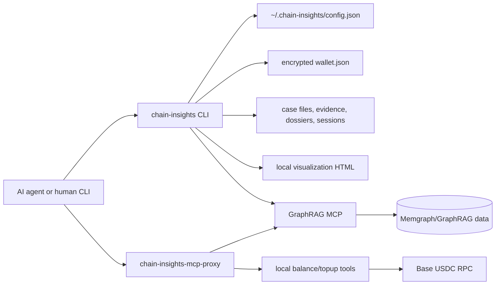

# Chain Insights

Local-first AML investigation tooling for AI agents. Chain Insights connects an investigator's terminal, case files, browser visualizations, and the live Chain Insights GraphRAG MCP into one repeatable workflow.

The toolkit is intentionally small at the edge: Node.js CLI, embedded DuckDB, flat case files, x402-ready MCP access, and browser artifacts that stay on the operator's machine.

## Table of Contents

1. [What This Is](#what-this-is)
2. [Current Capabilities](#current-capabilities)
3. [Quick Start](#quick-start)
4. [Configuration](#configuration)
5. [GraphRAG MCP Usage](#graphrag-mcp-usage)
6. [Wallet Balance and Top-Up](#wallet-balance-and-top-up)
7. [Cases, Evidence, Dossiers, and Sessions](#cases-evidence-dossiers-and-sessions)
8. [Playbooks](#playbooks)
9. [Money Flow Visualization](#money-flow-visualization)
10. [Agent MCP Proxy](#agent-mcp-proxy)
11. [Human UAT Smoke Test](#human-uat-smoke-test)
12. [Architecture](#architecture)
13. [Local Data and Security](#local-data-and-security)
14. [Development](#development)
15. [Troubleshooting](#troubleshooting)

## What This Is

Chain Insights is an open-source agent framework for crypto AML investigations. It gives Claude Code, Codex, and other MCP-capable agents a local investigation workspace:

- Discover and call the live Chain Insights GraphRAG MCP.
- Pay for production MCP calls through x402 on Base, or use a configured debug bearer token for local UAT.
- Keep case state, evidence, dossiers, sessions, and visualizations on disk.
- Run repeatable investigation playbooks tied to the real GraphRAG public tool surface.
- Top up and inspect the local Base USDC payment wallet.

The v1 scope is a local operator toolkit. It is not a hosted SaaS app, wallet custodian, chain indexer, or replacement for the GraphRAG MCP service.

## Current Capabilities

| Area | Status | Entry Points |
| --- | --- | --- |
| CLI and local server | Working | `chain-insights --help`, `chain-insights serve` |
| MCP discovery and direct calls | Working | `chain-insights mcp tools`, `chain-insights mcp call` |
| x402/debug-token MCP auth | Working | `walletPrivateKey` or `mcpAuthToken` config |
| Local wallet balance and browser top-up | Working | `chain-insights wallet balance`, `chain-insights wallet topup` |
| Case lifecycle | Working | `chain-insights case open/list/activate/suspend/close` |
| Evidence and dossiers | Working | `chain-insights case evidence`, `chain-insights case dossier` |
| Session resume context | Working | `chain-insights case session`, `chain-insights case resume` |
| Money flow visualization | Working | `chain-insights viz` |
| Playbooks | Working | `chain-insights playbook run/list/show` |

Current known public GraphRAG tools:

| Tool | Purpose |
| --- | --- |
| `address_risk` | Risk and entity screening for an address |
| `track_funds` | Fund tracing from trusted/source addresses |
| `money_flows_between_exchanges` | Exchange-to-exchange flow analysis |
| `address_connection_risk` | Connection/path risk between addresses |
| `graph_query` | Direct Cypher query against the GraphRAG graph |

## Quick Start

From this repository:

```bash
npm install
npm run build
node bin/cli.js --help
```

Installed package usage:

```bash
chain-insights --help
chain-insights status
```

Configure the live GraphRAG MCP endpoint:

```bash
chain-insights config set mcpEndpoint http://localhost:8011/mcp
chain-insights config set mcpAuthToken "$GRAPHRAG_DEBUG_TOKEN"
chain-insights mcp tools --refresh
```

Run a real GraphRAG query:

```bash
chain-insights mcp call graph_query \
  network=bittensor \
  "query=MATCH (n) WHERE n.address IS NOT NULL RETURN labels(n) AS labels, n.address AS address LIMIT 10"
```

Example Bittensor address from a local Memgraph UAT dataset:

```text
5Ccmf1dJKzGtXX7h17eN72MVMRsFwvYjPVmkXPUaapczECf6
```

## Configuration

Configuration is stored in `~/.chain-insights/config.json` with `0600` permissions.

```bash
chain-insights config get mcpEndpoint
chain-insights config set mcpEndpoint http://localhost:8011/mcp
chain-insights config set mcpAuthToken "$GRAPHRAG_DEBUG_TOKEN"
```

Wallet private keys are intercepted before config write and stored encrypted in `~/.chain-insights/wallet.json`:

```bash
chain-insights config set walletPrivateKey 0xYOUR_EVM_PRIVATE_KEY
```

Supported config keys:

| Key | Purpose |
| --- | --- |
| `mcpEndpoint` | Remote GraphRAG MCP endpoint |
| `mcpAuthToken` | Debug/M2M bearer token for local GraphRAG UAT |
| `walletAddress` | Optional metadata field |
| `serverPort` | Local visualization server port |
| `dataDir` | Local Chain Insights data directory |
| `version` | Config schema version |

Optional environment variable:

```bash
BASE_RPC_URL=https://mainnet.base.org
```

`BASE_RPC_URL` is used by wallet balance and top-up balance refresh. If unset, the toolkit uses `https://mainnet.base.org`.

## GraphRAG MCP Usage

List live remote tools:

```bash
chain-insights mcp tools --refresh
```

Call a tool directly:

```bash
chain-insights mcp call graph_query \
  network=bittensor \
  "query=MATCH (n) WHERE n.address IS NOT NULL RETURN labels(n) AS labels, n.address AS address LIMIT 10"
```

Inspect the remote MCP endpoint without Chain Insights:

```bash
npx @modelcontextprotocol/inspector \
  --cli http://localhost:8011/mcp \
  --transport http \
  --method tools/list
```

Auth behavior:

- If `mcpAuthToken` is set, Chain Insights sends both `X-MCP-Debug-Token` and `Authorization: Bearer <token>`.
- If `mcpAuthToken` is empty, Chain Insights uses the encrypted wallet private key with x402 payment handling.
- The schema cache lives at `~/.chain-insights/mcp-schema.json` and has a 24 hour TTL. Use `--refresh` to force a live schema fetch.

## Wallet Balance and Top-Up

Show the local payment wallet address:

```bash
chain-insights wallet address
```

Show Base USDC balance:

```bash
chain-insights wallet balance
```

Open a local browser top-up flow:

```bash
chain-insights wallet topup
```

Print the URL without opening a browser:

```bash
chain-insights wallet topup --no-open
```

Machine-readable output:

```bash
chain-insights wallet topup --json --no-open
```

The top-up page binds to `127.0.0.1` on a random local port, displays the payment wallet address and current Base USDC balance, and includes a MetaMask-compatible USDC transfer flow. It sends Base USDC to the Chain Insights payment wallet; it does not request or store browser wallet private keys.

The local MCP proxy also exposes:

| Local Tool | Meaning |
| --- | --- |
| `balance` | Return local Chain Insights wallet address and Base USDC balance |
| `topup` | Start the local browser top-up server and return the URL |

These local tools are available through `chain-insights-mcp-proxy`, not through the remote GraphRAG endpoint.

## Cases, Evidence, Dossiers, and Sessions

Open and manage a case:

```bash
chain-insights case open "Exchange deposit clustering" \
  --tags aml,bittensor \
  --description "Trace high-risk source funds into exchange entities"

chain-insights case list
chain-insights case activate <case-id>
chain-insights case suspend <case-id>
chain-insights case close <case-id>
```

Append evidence:

```bash
chain-insights case evidence add <case-id> \
  --source graph_query \
  --query-params "network=bittensor address=5Ccm..." \
  --content "$(cat result.json)"
```

Verify evidence integrity:

```bash
chain-insights case evidence verify <case-id>
```

Maintain an entity dossier:

```bash
chain-insights case dossier update <case-id> 5Ccmf1dJKzGtXX7h17eN72MVMRsFwvYjPVmkXPUaapczECf6 \
  --type unknown \
  --finding "Appears in live GraphRAG address sample; continue risk screening."
```

Manage sessions and restore context:

```bash
chain-insights case session start <case-id>
chain-insights case session end <case-id> \
  --findings "Initial graph query returned miner and address nodes." \
  --next-steps "Run address_risk and track_funds."
chain-insights case resume <case-id>
```

## Playbooks

List built-ins:

```bash
chain-insights playbook list
```

Show a playbook before running it:

```bash
chain-insights playbook show risk-check
```

Run an address risk check:

```bash
chain-insights playbook run risk-check \
  -p address=5Ccmf1dJKzGtXX7h17eN72MVMRsFwvYjPVmkXPUaapczECf6 \
  -p network=bittensor
```

Run a trace playbook and attach evidence to a case:

```bash
chain-insights playbook run trace-funds \
  --case <case-id> \
  -p address=5Ccmf1dJKzGtXX7h17eN72MVMRsFwvYjPVmkXPUaapczECf6 \
  -p network=bittensor
```

Dry-run before spending MCP calls:

```bash
chain-insights playbook run trace-funds \
  -p address=5Ccmf1dJKzGtXX7h17eN72MVMRsFwvYjPVmkXPUaapczECf6 \
  --dry-run
```

Built-in playbooks validate their tool names against the live MCP schema before execution. This is the guardrail that prevents stale or hallucinated playbooks from running against nonexistent tools.

## Money Flow Visualization

Generate an ad hoc visualization from a JSON file:

```bash
chain-insights viz --data ./sample-transactions.json
```

Generate a visualization for a case:

```bash
chain-insights viz <case-id>
```

The CLI writes self-contained HTML under `~/.chain-insights/viz/` or `~/.chain-insights/cases/<case-id>/viz/`, starts the local server, and opens the browser.

## Agent MCP Proxy

Use the stdio proxy when an AI agent should consume Chain Insights as an MCP server:

```json
{
  "mcpServers": {
    "chain-insights": {
      "command": "chain-insights-mcp-proxy"
    }
  }
}
```

The proxy:

- Connects to the configured remote GraphRAG MCP endpoint.
- Uses debug bearer auth or x402 payment auth according to local config.
- Caches remote tool schemas for 24 hours.
- Re-exposes remote GraphRAG tools.
- Adds local `balance` and `topup` tools for wallet operations.

## Human UAT Smoke Test

Use this sequence after a fresh build or install:

```bash
npm run build
node bin/cli.js --help
node bin/cli.js wallet --help
node bin/cli.js config set mcpEndpoint http://localhost:8011/mcp
node bin/cli.js config set mcpAuthToken "$GRAPHRAG_DEBUG_TOKEN"
node bin/cli.js mcp tools --refresh
node bin/cli.js mcp call graph_query \
  network=bittensor \
  "query=MATCH (n) WHERE n.address IS NOT NULL RETURN labels(n) AS labels, n.address AS address LIMIT 10"
node bin/cli.js wallet address
node bin/cli.js wallet balance
node bin/cli.js wallet topup --no-open
```

Expected results:

- CLI help lists `status`, `config`, `mcp`, `wallet`, `case`, `playbook`, and `viz`.
- `mcp tools --refresh` lists the live GraphRAG tools.
- `graph_query` returns real Memgraph rows.
- `wallet balance` prints the local payment wallet and Base USDC balance.
- `wallet topup --no-open` prints a `127.0.0.1` URL and keeps the top-up server running until `Ctrl+C`.

## Architecture



Primary modules:

| Module | Responsibility |
| --- | --- |
| `src/cli.ts` | Commander CLI and command routing |
| `src/config/` | Local config schema and storage |
| `src/wallet/` | Encrypted EVM wallet, Base USDC balance, browser top-up |
| `src/mcp/` | x402/debug-token MCP client, schema cache, stdio proxy |
| `src/cases/` | Case state, evidence, dossiers, sessions |
| `src/playbooks/` | Markdown playbook parser, built-ins, runner |
| `src/viz/` | D3 graph data model and self-contained HTML generation |
| `src/server/` | Local Hono server for visualization artifacts |

## Local Data and Security

Local data defaults to `~/.chain-insights/`:

| Path | Contents |
| --- | --- |
| `config.json` | MCP endpoint, auth token, server port, data dir |
| `wallet.json` | AES-256-GCM encrypted EVM private key |
| `mcp-schema.json` | 24 hour cached remote MCP tool schema |
| `chain-insights.duckdb` | Embedded case database |
| `cases/<case-id>/` | Case metadata, evidence, dossiers, sessions, visualizations |
| `viz/` | Ad hoc visualization HTML |

Security properties:

- Wallet private keys are never written to `config.json`.
- `wallet.json`, `config.json`, and `mcp-schema.json` are written with owner-only permissions.
- Investigation data stays local; there is no telemetry or cloud sync.
- The top-up server binds to `127.0.0.1`.
- Production x402 spends should use a hot wallet with limited funds.

## Development

Required runtime:

- Node.js 22+
- npm

Useful commands:

```bash
npm install
npm run typecheck
npm test
npm run build
```

Focused tests for MCP and wallet work:

```bash
npx vitest run \
  tests/wallet.test.ts \
  tests/wallet-tools.test.ts \
  tests/topup-server.test.ts \
  tests/mcp-client.test.ts \
  tests/mcp-proxy.test.ts \
  tests/cli.test.ts
```

If DuckDB native bindings break after switching Node versions:

```bash
npm rebuild @duckdb/node-api
```

## Troubleshooting

### `Wallet not configured and mcpAuthToken is empty`

Set a debug token for local GraphRAG UAT:

```bash
chain-insights config set mcpAuthToken "$GRAPHRAG_DEBUG_TOKEN"
```

Or configure a funded x402 payment wallet:

```bash
chain-insights config set walletPrivateKey 0xYOUR_EVM_PRIVATE_KEY
chain-insights wallet topup
```

### `chain-insights mcp tools` is stale

Force schema refresh:

```bash
chain-insights mcp tools --refresh
```

### `wallet balance` cannot reach Base RPC

Set a reliable Base RPC URL:

```bash
BASE_RPC_URL=https://mainnet.base.org chain-insights wallet balance
```

### Top-up page opens but MetaMask cannot send

Check that the browser wallet is connected, switched to Base, and has enough USDC and ETH for gas. The page sends a Base USDC ERC-20 transfer to the Chain Insights payment wallet.

### Playbook refuses to run because a tool is unavailable

Refresh the live MCP schema and inspect the current tool list:

```bash
chain-insights mcp tools --refresh
chain-insights playbook show <playbook>
```

The runner fails closed when a playbook references a tool that is not present in the live GraphRAG schema.
