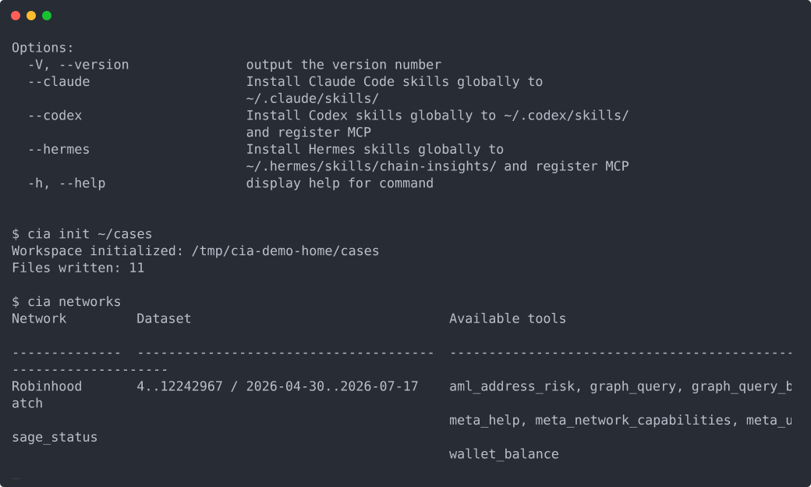

# Chain Insights

[](https://www.npmjs.com/package/chain-insights)
[](https://github.com/chainswarm/chain-insights/actions/workflows/verify.yml)
[](https://securityscorecards.dev/viewer/?uri=github.com/chainswarm/chain-insights)
[](https://github.com/chainswarm/chain-insights/blob/main/LICENSE)

[Website](https://chain-insights.ai) | [npm](https://www.npmjs.com/package/chain-insights)

Chain Insights is open-source AML and forensics infrastructure for AI agents
and analysts: a hosted Chain Insights Graph you reach over MCP, screened
through one CLI. It screens blockchain addresses for risk, explores fund flows
through read-only graph queries, and renders graph reports from your own
investigation folders. Every new account gets a free tier — a daily allowance
of graph queries, no payment setup — so you can run a first screen in minutes.

## Quickstart

All shell snippets in this documentation are for **Linux** (bash). They work
as-is on macOS; on Windows use WSL.

```bash
npx chain-insights@latest --help   # run without installing
npm install -g chain-insights      # or install the cia CLI globally
cia init ~/cases                   # optional local investigation folder
cia mcp call aml_address_risk network=robinhood address=0xYourAddressHere
cia networks                       # supported networks + public tool surface
```



Sixty seconds gets you the CLI, a workspace, and the live tool catalog.
To call the same tools from an agent, register the MCP proxy:
`cia setup claude-code` (or `codex` / `hermes`).

## Purpose And Ownership

One public npm package (`chain-insights`) providing the `cia` CLI and a
stdio MCP proxy over a Chain Insights Graph endpoint.

Owning group: chainswarm org, infra group.

## What It Does

Owns:

- The `cia` / `chain-insights` CLI and the `chain-insights-mcp-proxy` MCP
  server (source under `src/`).
- The canonical public tool surface: prefixed `aml_*` / `graph_*` / `meta_*`
  / `wallet_*` tools.
- Local wallet and payment on Base mainnet (payment chain only).
- Investigation workspaces, graph reports, and visualization.
- Shipped product skills under `skills/` (`chain-insights-*`), packaged
  into the npm tarball.
- The local Bittensor graph devkit under `devkit/`.

Never touches:

- Blockchain indexing, graph database storage, or graph serving — those
  belong to the Chain Insights Graph backend.
- Automatic risk labeling. Address labels are served by the Chain Insights
  Graph backend and read through `aml_address_risk`; the CLI never writes
  labels.
- Custodial wallets or hosted case databases. Investigation data stays in
  the local workspace unless the operator exports it.

### What You Can Do Today

| Tool | Use it for |
| --- | --- |
| `aml_address_risk` | Screen one address for risk, behavior, neighborhood context, and exchange exposure |
| `graph_query` | Run one read-only GQL/Cypher query against a Chain Insights Graph layer |
| `graph_query_batch` | Run related read-only graph queries as one MCP call |
| `meta_network_capabilities` | Check supported Chain Insights networks and graph tools |
| `meta_usage_status` | Check the caller's daily free-tier graph query allowance |
| `meta_help` | Show Chain Insights tool and workflow guidance |
| `wallet_balance` | Show the local payment wallet amount |

## Dependencies

Upstream:

- **Chain Insights Graph MCP endpoint** — all graph queries and AML
  primitives. Configured via `graphMcpEndpoint`; defaults to a local
  endpoint.
- **Base mainnet RPC** — wallet balance and payment only
  (`BASE_RPC_URL` override). Not a graph-support claim.
- **Devkit fixture data** — pre-generated from the upstream export path
  and committed under `devkit/data/`.

Downstream:

- Analysts and AI agents install the npm package and call the CLI or the
  MCP tools.

## Architecture

Chain Insights is the investigation layer above the Chain Insights Graph.
The CLI and MCP proxy call graph tools over one MCP endpoint, keep all
evidence in local workspace folders, and never write to the graph.

```text
Agent or CLI user
  -> Chain Insights CLI / MCP proxy
  -> local config, wallet, workspace, artifacts, reports
  -> Chain Insights Graph
  -> graph intelligence for AML workflows
```

Source modules (hand-maintained):

| Module | Entrypoint | Component doc |
|---|---|---|
| `config` | `src/config` | [components/config.md](docs/architecture/components/config.md) |
| `federation` | `src/federation` | [components/federation.md](docs/architecture/components/federation.md) |
| `investigation` | `src/investigation` | [components/investigation.md](docs/architecture/components/investigation.md) |
| `mcp` | `src/mcp` | [components/mcp.md](docs/architecture/components/mcp.md) |
| `server` | `src/server` | [components/server.md](docs/architecture/components/server.md) |
| `viz` | `src/viz` | [components/viz.md](docs/architecture/components/viz.md) |
| `wallet` | `src/wallet` | [components/wallet.md](docs/architecture/components/wallet.md) |

Entry points:

- `bin/cli.js` → `src/cli.ts` (CLI bins: `cia`, `chain-insights`).
- `bin/mcp-proxy.cjs` → `src/mcp/proxy.ts` (bin:
  `chain-insights-mcp-proxy`).
- `src/index.ts` — library exports.

Full architecture docs: [docs/architecture/](docs/architecture/ARCHITECTURE.md),
including C4 diagrams, [data contracts](docs/architecture/data-contracts.md),
and [operating rules](docs/architecture/operating-rules.md).

### Graph Access

Graph queries choose the read graph explicitly:

| Graph | Use it for |
| --- | --- |
| `topology` | The unified address / FLOWS_TO / LINKED graph — recent and full historical fund-flow traversal, plus the node `risk_score`/`risk_level` verdict |
| `facts` | Labels, features, assets, and enrichment |

One rule is worth reading before writing a query by hand: the `network`
argument selects the graph, not the addresses inside it. The address-space
split lives on the `:Address.network` node property. A `USE topology` match
on `:Address` without an exact address must scope itself with
`WHERE a.network = "..."`. On `USE facts` each network has its own backing
database and `Address` carries no `network` property at all. See
[Graph query compatibility](docs/graph-query-compatibility.md).

Agent installs include `chain-insights-address-risk` for one-address
screens, `chain-insights-cypher` for graph-query dialect rules,
`chain-insights-schema-evm` for the EVM / Robinhood graph map, and
`chain-insights-schema-bittensor` for the Bittensor graph map.

## Billing: Billable Units

Chain Insights Graph bills by **billable units**.

- A **billable unit** is one row, node, or edge in your returned payload.
- Bigger responses cost more. Narrow queries cost less.
- The server reports `billable_units` on every graph response.

**Check your own count.** `src/lib/recount-units.ts` mirrors the server's
counting logic. Use it client-side to recount units in a response and
confirm the billed amount matches what you received.

**Watch for `truncated: true`.** A response can hit the row limit and get
cut off. When you see `truncated: true`:

- Narrow the query with `LIMIT` to ask for fewer rows.
- Page through results with `SKIP` to fetch the next batch.
- Add a tighter `WHERE` filter before raising the limit.

**Workflow tools carry a `usage` block.** `aml_address_risk` runs many graph
queries behind the scenes to answer one question. Every response includes a
`usage` block with the total cost of all of them:

- **`billable_units`** — total units billed across every internal graph
  query this workflow ran.
- **`query_count`** — how many internal graph queries it took.
- **`truncated_queries`** — how many of those internal queries hit their
  row limit and got cut off.

Use `usage` to see the real cost of a workflow call, not just of one
`graph_query`.

## Prerequisites And Environment Setup

- **Linux** is the reference platform; shell snippets use bash (macOS works
  the same; on Windows use WSL).
- **Node.js 22 or newer** (`package.json` engines) and npm.
- Optional: Docker with the Compose plugin, for the local devkit backend.

`.env.example` documents the two supported overrides:

| Variable | Purpose |
| --- | --- |
| `BASE_RPC_URL` | Base RPC override for wallet balance and the local top-up page |
| `CHAIN_INSIGHTS_GRAPH_MCP_ENDPOINT` | Chain Insights Graph endpoint override; local HTTP loopback allowed, remote hosts must use `https://` |

## Run

### Local (from a checkout)

```bash
npm install
npm run build
npm install -g .
cia --version
```

Or install the released package:

```bash
npm install -g chain-insights
cia --version
cia update --check
```

Create an investigation workspace and run a first screen:

```bash
mkdir -p ./chain-insights-investigations
cd ./chain-insights-investigations
cia init .

cia mcp call aml_address_risk \
  network=robinhood address=0xYourAddressHere

find reports -maxdepth 3 -type f | sort
```

Workspaces are plain local folders. Reports, graph JSON, graph HTML, and
published bundles live under the initialized workspace. Export only when
you need to share, hand off, or archive a review checkpoint — the handoff
package lands under `published/<workspace-slug>/`.

Example queries. Direct topology:

```bash
cia mcp call graph_query \
  network=robinhood \
  "query=USE topology MATCH (a:Address) RETURN a.address AS address, a.network AS network, a.labels AS labels, a.risk_level AS risk_level LIMIT 10"
```

Batch across graph views:

```bash
cia mcp call graph_query_batch \
  network=robinhood \
  'queries=[{"id":"count","query":"USE topology MATCH (a:Address) RETURN count(a) AS count LIMIT 1"},{"id":"flows","query":"USE topology MATCH (src:Address)-[f:FLOWS_TO]->(dst:Address) RETURN src.address AS source, dst.address AS target, f.amount_usd_sum AS amount_usd_sum, f.tx_count AS tx_count LIMIT 3"},{"id":"linked","query":"USE topology MATCH (a:Address)-[l:LINKED]-(b:Address) RETURN a.address AS address, b.address AS linked_address, l.basis AS basis, l.confidence AS confidence LIMIT 3"},{"id":"node_metrics","query":"USE topology MATCH (a:Address {address:\"FULL_ADDRESS\"}) RETURN a.address AS address, a.tx_out_count AS tx_out_count, a.tx_in_count AS tx_in_count LIMIT 1"}]'
```

More query examples (manual fund-flow reads, pagination):
[Graph tools](docs/graph-tools.md).

### Dev Compose (local devkit backend)

The devkit runs a deterministic local Bittensor Chain Insights Graph
backend. Compose file: `devkit/docker-compose.yml` (default compose
project network). Services: `starrocks`, `memgraph`,
`starrocks-import`, `memgraph-import` (one-shot), and
`chain-insights-graph-devkit`. Images build locally with
`docker compose build` — never pulled from a registry.

Start from a clean state:

```bash
docker compose -f devkit/docker-compose.yml down -v --remove-orphans
docker compose -f devkit/docker-compose.yml up -d --build
```

One-shot import services must exit 0. `starrocks`, `memgraph`, and
`chain-insights-graph-devkit` must stay running. The MCP endpoint is
`http://127.0.0.1:18012/mcp`, unmetered:

```bash
export CHAIN_INSIGHTS_GRAPH_MCP_ENDPOINT=http://127.0.0.1:18012/mcp
```

Full contract and procedures live in the devkit directory's own README.

## Configure

`cia` uses `graphMcpEndpoint` for all Chain Insights Graph calls. The npm
package does not hardcode a hosted endpoint.

Local development endpoint (default):

```bash
cia config set graphMcpEndpoint http://127.0.0.1:8012/mcp
```

Public production Graph (operator configuration, never a package default).
Use the host root. Do not add `/mcp`.

```bash
cia config set graphMcpEndpoint https://mcp.chain-insights.ai/
```

Optional one-shot override from the environment:

```bash
export CHAIN_INSIGHTS_GRAPH_MCP_ENDPOINT=https://mcp.chain-insights.ai/
```

Configuration precedence:

1. `CHAIN_INSIGHTS_GRAPH_MCP_ENDPOINT` env var (`GRAPH_MCP_ENDPOINT`
   legacy alias also supported).
2. `cia config set graphMcpEndpoint ...` saved value.
3. Local default `http://127.0.0.1:8012/mcp`.

Validation rules:

- `http://` is accepted only for localhost / loopback addresses.
- Remote hosts must use `https://`.
- Endpoint URLs with credentials, query strings, or fragments are rejected.

Hosted access also needs an access mode, such as an approved access key or
a prepared wallet. For paid access, run `cia wallet ready` — it checks
funding and finishes one-time payment setup. Setup commands live in
[MCP proxy](docs/mcp-proxy.md).

The hosted graph includes a small public free tier for `graph_query`
(default: 10 execution seconds per IP per UTC day). Use
`meta_usage_status` to see the current caller allowance. Prepared wallet
users receive the free tier first, then paid access continues
automatically.

Search bounds (hops, row limits, frontiers) are tunable per call, per
network, or globally — see [Search limits](docs/search-limits.md).

## Test

Local gate, in order:

```bash
npm run typecheck
npm run build
npm test
npm run release:check   # PR-only step in verify.yml
```

Devkit-backed tiers (need the dev compose lane running):

```bash
npm run devkit:smoke
npm run devkit:smoke:parity
npm run test:devkit
```

CI install step, when reproducing CI:

```bash
npm ci --ignore-scripts --audit=false --fund=false
```

CI workflows: `.github/workflows/verify.yml` (typecheck, build,
release:check, tests, npm pack contents), `security.yml`, `scorecard.yml`,
`docs.yml`.

## Debug

- Diagnostics and debug workflows: [docs/debugging.md](docs/debugging.md).
- Skip payment negotiation against the unmetered devkit:
  `cia debug on --token <any-string> --endpoint http://127.0.0.1:18012/mcp`.
- MCP proxy structured logs: `~/.chain-insights/runtime/logs/mcp-proxy.jsonl`.

Health checks (each is runnable):

```bash
# Configured endpoint
cia config get graphMcpEndpoint

# Endpoint reachable, networks listed
cia mcp networks

# Caller allowance / metering status
cia mcp call meta_usage_status

# Fresh tool discovery
cia mcp tools --refresh

# Installed CLI sanity
cia --version && cia update --check

# Devkit service state (all imports exited 0, backends running)
docker compose -f devkit/docker-compose.yml ps -a
```

If network or tool discovery fails, check the endpoint and access mode
first. The CLI can still initialize workspaces and continue local
investigation workflow without a reachable endpoint.

## Documentation Links

Product docs:

| Doc | Use it for |
| --- | --- |
| [Graph tools](docs/graph-tools.md) | Graph layers, `graph_query`, `graph_query_batch`, AML tool contracts, graph reports |
| [Graph query compatibility](docs/graph-query-compatibility.md) | GQL/Cypher support per layer, rewrite recipes, traversal guidance |
| [Search limits](docs/search-limits.md) | Tunable search/row/frontier/hop bounds, precedence, ceilings |
| [Investigation workspaces](docs/investigation-workspaces.md) | `cia init`, workspace layout, artifacts, templates, reports, visualization |
| [MCP proxy](docs/mcp-proxy.md) | Stdio proxy behavior, endpoint configuration, agent installers, auth modes |
| [Architecture overview](docs/architecture.md) | Product layers, data flow, local storage, security model, config keys |
| [Development](docs/development.md) | Build, test, and local install commands |
| [Contributing](docs/contributing.md) | Development workflow, pull requests, release expectations |
| [Stability policy](docs/stability.md) | Guaranteed surfaces (exit codes, MCP tool names, workspace layout), deprecation rules |
| [Debugging](docs/debugging.md) | Local troubleshooting, diagnostics, debug workflows |
| Bittensor devkit (in this repo under `devkit/`) | Local Bittensor graph backend contract, fixture, smoke procedures |

Architecture depth:

- [docs/architecture/](docs/architecture/ARCHITECTURE.md) — index, C4
  diagrams, context, containers, components.
- [Data contracts](docs/architecture/data-contracts.md) — tool surface,
  search limits, endpoint rules, shared-graph model, devkit contract.
- [Operating rules](docs/architecture/operating-rules.md) — repo
  invariants, findings rules, CI gotchas.
- [docs/acceptance/](docs/acceptance/) — per-component acceptance evidence.
