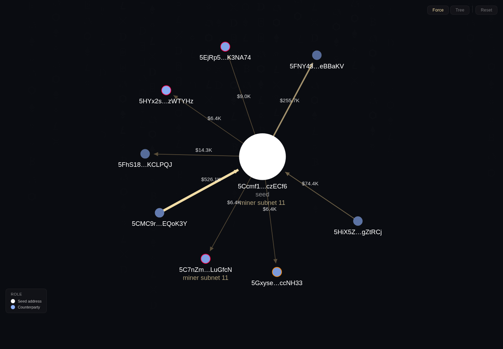
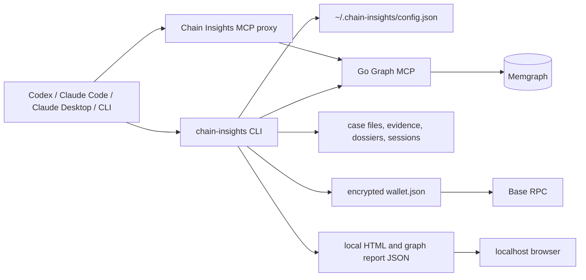

# Chain Insights

[](https://github.com/chainswarm/chain-insights/actions/workflows/verify.yml)
[](https://github.com/chainswarm/chain-insights/actions/workflows/security.yml)
[](https://scorecard.dev/viewer/?uri=github.com/chainswarm/chain-insights)
[](https://www.npmjs.com/package/chain-insights)

Local-first AML investigation tooling for AI agents and human operators. Chain Insights gives Codex, Claude Code, Claude Desktop, and other MCP clients a local workspace for paid graph access, wallet status, case files, evidence, dossiers, sessions, and browser visualizations.

The product has two layers:

1. `chain-insights mcp` connects clients to the paid Go Graph MCP primitive, handles x402/debug-token auth, and exposes local wallet/case tools.
2. `chain-insights case` is the investigation framework: Markdown/JSON workspaces, claims, evidence, dossiers, sessions, reports, and local graph report files.

## Table of Contents

1. [What This Is](#what-this-is)
2. [Current Capabilities](#current-capabilities)
3. [Quick Start](#quick-start)
4. [Configuration](#configuration)
5. [Graph MCP Usage](#graph-mcp-usage)
6. [Wallet Balance](#wallet-balance)
7. [Cases and Evidence](#cases-and-evidence)
8. [Visualizations](#visualizations)
9. [Agent MCP Proxy](#agent-mcp-proxy)
10. [Client Setup](#client-setup)
11. [Human UAT](#human-uat)
12. [Debug CLI Sketch](#debug-cli-sketch)
13. [Architecture](#architecture)
14. [Local Data and Security](#local-data-and-security)
15. [Development](#development)
16. [Troubleshooting](#troubleshooting)

## What This Is

Chain Insights is an open-source AML investigation framework that runs on the operator machine.

It is responsible for:

- Connecting MCP clients to the paid Go Graph MCP endpoint.
- Paying production MCP calls through x402 on Base, or using a debug bearer token for local UAT.
- Keeping the local payment wallet encrypted under `~/.chain-insights`.
- Showing the Base USDC wallet balance through CLI and MCP.
- Creating case workspaces with evidence, dossiers, sessions, and reports.
- Writing graph data to local JSON files and serving HTML graph views from localhost.

It is not a hosted SaaS app, wallet custodian, chain indexer, or replacement for GraphRAG sync. GraphRAG owns StarRocks-to-Memgraph sync and the paid graph query primitive.

## Current Capabilities

| Area | Status | Entry Points |
| --- | --- | --- |
| CLI and local server | Working | `chain-insights --help`, `chain-insights serve` |
| Graph MCP client | Working | `chain-insights mcp tools`, `chain-insights mcp call` |
| Debug-token MCP auth | Working | `graphMcpAuthToken` |
| x402 client fetch | Implemented | encrypted wallet private key |
| Wallet balance | Working | `chain-insights wallet balance`, MCP `balance` |
| Case lifecycle | Working | `chain-insights case open/list/activate/suspend/close` |
| Evidence and dossiers | Working | `chain-insights case evidence`, `chain-insights case dossier` |
| Session resume context | Working | `chain-insights case session`, `chain-insights case resume` |
| Graph visualization | Working | `chain-insights viz`, local graph report server |
| Claude Desktop setup | Basic MCP setup | `chain-insights setup claude-desktop` |

The current Go Graph MCP public surface is:

| Tool | Purpose |
| --- | --- |
| `graph_query` | Run one read-only Cypher query against the graph |
| `graph_query_batch` | Run related read-only Cypher queries as one MCP call |

High-level AML tools such as `address_risk`, `track_funds`, `money_flows_between_exchanges`, and `address_connection_risk` are migration targets for Chain Insights recipes over `graph_query_batch`. They should not be assumed to exist on the Go Graph MCP endpoint.

`topup` is not advertised as a supported MCP happy path. The supported wallet surface is `balance` plus the wallet address returned by CLI/MCP.

## Quick Start

From this repository:

```bash
npm install
npm run build
node bin/cli.js --help
```

Installed package usage:

```bash
chain-insights --help
chain-insights status
```

By default Chain Insights uses the staging production Graph MCP:

```bash
chain-insights config get graphMcpEndpoint
chain-insights mcp tools --refresh
```

Switch to a local Go Graph MCP for debug UAT:

```bash
chain-insights debug on --token chain-insights-dev-debug --endpoint http://localhost:8012/mcp
chain-insights mcp tools --refresh
```

Switch back to the staging production endpoint:

```bash
chain-insights config set graphMcpEndpoint https://staging-mcp.chain-insights.ai/mcp
chain-insights debug off
chain-insights mcp tools --refresh
```

Run a real graph query:

```bash
chain-insights mcp call graph_query \
  network=bittensor \
  "query=MATCH (n) WHERE n.address IS NOT NULL RETURN labels(n) AS labels, n.address AS address LIMIT 10"
```

Run a paid-primitive batch call:

```bash
chain-insights mcp call graph_query_batch \
  network=bittensor \
  'queries=[{"id":"count","query":"MATCH (n) RETURN count(n) AS count LIMIT 1"},{"id":"sample","query":"MATCH (n) WHERE n.address IS NOT NULL RETURN labels(n) AS labels, n.address AS address LIMIT 3"}]'
```

Example Bittensor address from local Memgraph:

```text
5Ccmf1dJKzGtXX7h17eN72MVMRsFwvYjPVmkXPUaapczECf6
```

## Configuration

Configuration is stored in `~/.chain-insights/config.json` with owner-only permissions.

Primary graph MCP config:

```bash
chain-insights config get graphMcpEndpoint
chain-insights config set graphMcpEndpoint https://staging-mcp.chain-insights.ai/mcp
```

Local debug mode without x402 payments:

```bash
chain-insights debug on --token chain-insights-dev-debug --endpoint http://localhost:8012/mcp
chain-insights debug status
```

Paid mode for production endpoints that support x402:

```bash
chain-insights config set graphMcpEndpoint https://staging-mcp.chain-insights.ai/mcp
chain-insights debug off
chain-insights config set walletPrivateKey 0xYOUR_EVM_PRIVATE_KEY
chain-insights wallet balance
```

Test access key mode for invited users without x402 payment:

```bash
chain-insights access-key set ci_test_REDACTED --endpoint https://staging-mcp.chain-insights.ai/mcp
chain-insights access-key status
chain-insights mcp call graph_query network=bittensor query='MATCH (n) RETURN n LIMIT 1'
```

The Go Graph MCP treats a valid test access key as a server-side x402 bypass. Operators configure the server with `MCP_TEST_ACCESS_KEY_HASHES`, a comma-separated list of `key_id:sha256(full_key)` entries:

```bash
export TEST_KEY="ci_test_$(openssl rand -hex 24)"
printf '%s' "$TEST_KEY" | sha256sum
export MCP_TEST_ACCESS_KEY_HASHES="partner-a:<sha256-from-command>"
```

Share the raw `ci_test_...` key once. Store only its SHA-256 hash in deployment config. Revoke by removing the entry and redeploying the Graph MCP.

Supported config keys:

| Key | Purpose |
| --- | --- |
| `graphMcpEndpoint` | Go Graph MCP endpoint used by CLI and proxy |
| `graphMcpAuthToken` | Graph MCP bearer credential for test access keys or local debug UAT |
| `mcpEndpoint` | Legacy endpoint fallback |
| `mcpAuthToken` | Legacy debug token fallback |
| `walletAddress` | Optional wallet metadata |
| `serverPort` | Local visualization and graph report server port |
| `dataDir` | Local Chain Insights data directory |
| `version` | Config schema version |

Wallet private keys are intercepted before config write and stored encrypted in `~/.chain-insights/wallet.json`.

Optional Base RPC override:

```bash
BASE_RPC_URL=https://mainnet.base.org
```

If `BASE_RPC_URL` is unset, wallet balance checks try public Base RPC endpoints starting with `https://mainnet.base.org`.

## Graph MCP Usage

List live graph tools:

```bash
chain-insights mcp tools --refresh
```

Expected Go Graph MCP tools:

```text
graph_query
graph_query_batch
```

Inspect the graph MCP endpoint without Chain Insights:

```bash
npx @modelcontextprotocol/inspector \
  --cli http://localhost:8012/mcp \
  --transport http \
  --method tools/list \
  --header "X-MCP-Debug-Token: chain-insights-dev-debug"
```

Auth behavior:

- If `graphMcpAuthToken` is set, Chain Insights sends both `X-MCP-Debug-Token` and `Authorization: Bearer <token>`.
- A staging/public Graph MCP may accept a valid `ci_test_...` access key through the same config path and skip x402 for that request.
- If `graphMcpAuthToken` is empty, Chain Insights uses the encrypted wallet private key with x402 payment handling.
- Prefer `chain-insights access-key set <key>` for invited tester setup. Keep `chain-insights debug on --token <token>` for local/internal debug bypasses.
- The graph schema cache is scoped by endpoint and expires after 24 hours. Use `--refresh` for a live schema fetch.

Graph query rules:

- `network` is required. Do not guess it in agent workflows.
- Cypher must be read-only.
- Use `graph_query_batch` for related reads that should share one paid call.
- `per_query_timeout_seconds` is optional and capped at `10`.
- Returned rows live in `structuredContent.facts`.

Batch result facts include:

```json
{
  "batch": {
    "count": 2,
    "completed": 2,
    "failed": 0,
    "per_query_timeout_seconds": 10,
    "total_query_elapsed_ms": 1345,
    "billable_seconds": 2,
    "estimated_usdc": "0.02"
  }
}
```

## Wallet Balance

Show the local payment wallet address:

```bash
chain-insights wallet address
```

Show Base USDC balance:

```bash
chain-insights wallet balance
```

The Chain Insights MCP server advertises `balance` as the wallet status tool. It returns the wallet address, network, token, and Base USDC balance. It does not expose a supported `topup` MCP tool.

## Cases and Evidence

Open and manage a case:

```bash
chain-insights case open "Exchange deposit clustering" \
  --tags aml,bittensor \
  --description "Trace high-risk source funds into exchange entities"

chain-insights case list
chain-insights case activate <case-id>
chain-insights case suspend <case-id>
chain-insights case close <case-id>
```

Append evidence:

```bash
chain-insights case evidence add <case-id> \
  --source graph_query_batch \
  --query-params "network=bittensor" \
  --content "$(cat result.json)"
```

Verify evidence integrity:

```bash
chain-insights case evidence verify <case-id>
```

Maintain an entity dossier:

```bash
chain-insights case dossier update <case-id> 5Ccmf1dJKzGtXX7h17eN72MVMRsFwvYjPVmkXPUaapczECf6 \
  --type unknown \
  --finding "Appears in the graph address sample; continue risk screening."
```

Manage sessions and restore context:

```bash
chain-insights case session start <case-id>
chain-insights case session end <case-id> \
  --findings "Initial graph query returned miner and address nodes." \
  --next-steps "Run focused graph_query_batch probes."
chain-insights case resume <case-id>
```

The framework direction is visible workspaces under a normal editor or terminal. Case state should be easy to inspect as Markdown and JSON, not hidden behind a desktop chat transcript.

## Visualizations

Interactive graph with Force, Tree, and Reset controls:


MCP graph app resource:



Generate an ad hoc visualization from a JSON file:

```bash
chain-insights viz --data ./sample-transactions.json
```

Generate a visualization for a case:

```bash
chain-insights viz <case-id>
```

The CLI writes self-contained HTML under `~/.chain-insights/viz/` or `~/.chain-insights/cases/<case-id>/viz/`, starts the local server, and opens the browser.

MCP compatibility path:

- Graph-backed upstream tools may return raw graph data in `_meta.chainInsights.graph.data`.
- Chain Insights stores that graph data under `reports/graphs/*.graph.json`.
- Chain Insights returns `_meta.chainInsights.graph.url` pointing to `/graph-reports/<filename>.graph.json` for the app iframe.
- The local graph report server starts automatically when a graph report URL is returned.

The preferred framework path is a case-local HTML file plus adjacent JSON, served from localhost and visible in the editor workspace.

## Agent MCP Proxy

Use the stdio proxy when an AI agent should consume Chain Insights as an MCP server:

```json
{
  "mcpServers": {
    "chain-insights": {
      "command": "chain-insights-mcp-proxy"
    }
  }
}
```

The proxy:

- Connects to `graphMcpEndpoint`.
- Uses debug bearer auth or x402 payment auth according to local config.
- Caches remote tool schemas per endpoint for 24 hours.
- Exposes graph tools returned by the endpoint.
- Adds local `balance`, `help`, and case workflow tools.
- Publishes server instructions with required argument rules, workflow guidance, graph report behavior, and schema hints.

Local MCP tools:

| Tool | Purpose |
| --- | --- |
| `balance` | Show the local Base USDC payment wallet balance |
| `help` | Show Chain Insights tool and workflow guidance |
| `case_open` | Create a local investigation case |
| `case_list` | List local investigation cases |
| `case_resume` | Load case context, evidence count, dossiers, and latest session |
| `case_add_evidence` | Append a report or note to the evidence manifest |
| `case_verify_evidence` | Verify saved evidence integrity |
| `case_update_dossier` | Add a durable finding to an address/entity dossier |
| `case_start_session` | Start an investigation session |
| `case_end_session` | End a session with findings and next steps |

## Client Setup

### Codex and Claude Code

Use Chain Insights from the repository or from an installed binary:

```bash
chain-insights config set graphMcpEndpoint https://staging-mcp.chain-insights.ai/mcp
chain-insights debug off
chain-insights mcp tools --refresh
```

Then open the case workspace in VS Code, Codex, Claude Code, Hermes, or another agent and operate over the files.

### Claude Desktop

Claude Desktop is supported for basic MCP calls. It is not the primary framework UI.

Configure it:

```bash
chain-insights setup claude-desktop --dry-run
chain-insights setup claude-desktop
```

Validate without opening Claude:

```bash
npx @modelcontextprotocol/inspector \
  --cli \
  --config ~/.config/Claude/claude_desktop_config.json \
  --server chain-insights \
  --method tools/list
```

Claude Desktop does not hot-reload its MCP config. Fully quit and reopen it after setup.

Hard-stop Claude Desktop and Chain Insights MCP processes on Linux:

```bash
mapfile -t claude_pids < <(
  pgrep -f '/home/aphex5/work/chain-insights/bin/mcp-proxy[.]cjs|chain-insights-mcp-prox[y]|claude-d[e]sktop|/usr/lib/claude-d[e]sktop|electron.*app[.]asar' || true
)
if ((${#claude_pids[@]})); then
  kill -TERM "${claude_pids[@]}" 2>/dev/null || true
fi
sleep 2
if ((${#claude_pids[@]})); then
  kill -KILL "${claude_pids[@]}" 2>/dev/null || true
fi
rm -f ~/.config/Claude/SingletonLock ~/.config/Claude/SingletonSocket ~/.config/Claude/SingletonCookie
```

Avoid starting Claude Desktop with `nohup` in this environment. Prefer the desktop launcher, or:

```bash
setsid -f /usr/bin/claude-desktop >/tmp/claude-desktop.log 2>&1 </dev/null
```

Useful MCP prompts:

```text
Use Chain Insights to show my payment wallet balance.
```

```text
Use Chain Insights graph_query on network bittensor with:
MATCH (n) WHERE n.address IS NOT NULL RETURN labels(n) AS labels, n.address AS address LIMIT 10
```

```text
Use Chain Insights graph_query_batch on network bittensor with these read-only Cypher queries:
1. MATCH (n) RETURN count(n) AS count LIMIT 1
2. MATCH (n) WHERE n.address IS NOT NULL RETURN labels(n) AS labels, n.address AS address LIMIT 3
```

```text
Use Chain Insights to open an investigation case named "Exchange deposit clustering" with tags aml,bittensor.
```

```text
Use Chain Insights to save the last graph_query_batch result as evidence in case <case-id>.
```

## Human UAT

Start Go Graph MCP with debug bypass:

```bash
cd /home/aphex5/work/rbmk/repos/ml
docker compose -f compose/shared.yml build graphrag-mcp-go
GRAPH_MCP_GO_DEBUG_BYPASS_ENABLED=true \
GRAPH_MCP_GO_DEBUG_BYPASS_TOKEN=chain-insights-dev-debug \
docker compose -f compose/shared.yml up -d graphrag-mcp-go
```

Run Chain Insights smoke checks:

```bash
cd /home/aphex5/work/chain-insights
npm run build
node bin/cli.js debug on --token chain-insights-dev-debug --endpoint http://localhost:8012/mcp
node bin/cli.js mcp tools --refresh
node bin/cli.js mcp call graph_query_batch \
  network=bittensor \
  'queries=[{"id":"count","query":"MATCH (n) RETURN count(n) AS count LIMIT 1"},{"id":"sample","query":"MATCH (n) WHERE n.address IS NOT NULL RETURN labels(n) AS labels, n.address AS address LIMIT 3"}]'
node bin/cli.js wallet address
node bin/cli.js wallet balance
```

Expected results:

- `mcp tools --refresh` lists `graph_query` and `graph_query_batch`.
- `graph_query_batch` returns `structuredContent.facts.batch.billable_seconds`.
- No high-level AML tools are served by Go Graph MCP.
- `wallet balance` prints the local wallet and Base USDC balance.

GraphRAG/Chain Insights UAT skill:

```bash
skills/test-chain-insights-graphrag-mcp/scripts/run-uat.sh
```

The skill builds or reuses local build outputs, calls the real graph MCP endpoint, runs the Chain Insights proxy, verifies graph reports served from `/graph-reports/<filename>.graph.json`, and writes a timestamped report under `.tmp/uat/`.

## Debug CLI Sketch

Implemented setup helpers:

```bash
chain-insights setup claude-desktop --dry-run
chain-insights setup claude-desktop
```

Proposed diagnostic surface:

```bash
chain-insights debug
chain-insights debug mcp
chain-insights debug clients
chain-insights debug graph-report <filename.graph.json>
chain-insights debug browser --graph-report <filename.graph.json>
```

Expected checks:

| Command | Checks |
| --- | --- |
| `debug` | Config path, data dir, wallet presence, schema cache age, local server URL |
| `debug mcp` | `graphMcpEndpoint`, auth mode, `tools/list`, proxy `tools/list`, proxy `resources/list` |
| `debug clients` | Known client config files, command paths, Inspector smoke tests |
| `debug graph-report <filename.graph.json>` | Report file exists, graph schema, node/edge/flow counts, local server fetch works |
| `debug browser --graph-report <filename.graph.json>` | Opens the graph app and verifies `_meta.chainInsights.graph.url` loading |

Rules:

- Redact tokens and never print wallet private keys.
- Do not perform paid production MCP calls unless `--live-call` is explicit.
- Default to human-readable output; add `--json` for CI.
- Prefer exact failure causes over broad health summaries.

## Architecture



Primary modules:

| Module | Responsibility |
| --- | --- |
| `src/cli.ts` | Commander CLI and command routing |
| `src/config/` | Local config schema and storage |
| `src/wallet/` | Encrypted EVM wallet and Base USDC balance |
| `src/mcp/` | x402/debug-token MCP client, schema cache, stdio proxy |
| `src/cases/` | Case state, evidence, dossiers, sessions |
| `src/playbooks/` | Existing playbook runner; migrate away from stale tool assumptions |
| `src/viz/` | Graph data model and self-contained HTML generation |
| `src/server/` | Local Hono server for visualization and graph reports |

## Local Data and Security

Default data directory:

```text
~/.chain-insights/
  config.json
  wallet.json
  mcp-schema-*.json
  chain-insights.duckdb
  cases/
  viz/
```

Security rules:

- `wallet.json`, `config.json`, and schema cache files use owner-only permissions.
- Wallet private keys are encrypted with AES-256-GCM.
- Debug bearer tokens are redacted in CLI output.
- Test access keys are payment bypass credentials. Generate high-entropy `ci_test_...` values, store only hashes server-side, scope distribution to invited testers, and rotate by removing the hash from Graph MCP deployment config.
- Production x402 should use a hot wallet with limited funds.
- Graph report JSON is stored under `reports/graphs/*.graph.json` in the active workspace and served from `127.0.0.1` at `/graph-reports/<filename>.graph.json`.
- Chain Insights does not custody user funds.
- CI runs typecheck, tests, build, npm package packing, npm vulnerability audit, npm registry signature verification, secret-pattern scanning, CodeQL, OpenSSF Scorecard, and Dependabot updates for npm and GitHub Actions.

## Development

Install and build:

```bash
npm install
npm run build
```

Run tests:

```bash
npm test
npm run typecheck
npm run build
```

Release discipline:

- Work on PR branches only. GitHub blocks direct pushes to `main`.
- Every PR to `main` must bump `package.json` and `package-lock.json` with a higher semver version.
- Every PR to `main` must add a matching `CHANGELOG.md` entry, for example `## [0.2.0] - 2026-05-18`.
- The release gate runs in Verify on pull requests and can be run locally with:

```bash
npm run release:check
```

Focused tests for MCP and wallet work:

```bash
npm test -- \
  tests/mcp-client.test.ts \
  tests/mcp-proxy.test.ts \
  tests/mcp-schema-cache.test.ts \
  tests/cli-mcp.test.ts \
  tests/wallet.test.ts \
  tests/wallet-tools.test.ts \
  tests/viz-html-generator.test.ts \
  tests/mcp-graph-reports.test.ts \
  tests/viz-server.test.ts
```

## Troubleshooting

### Graph MCP tools are stale

Refresh the live schema:

```bash
chain-insights mcp tools --refresh
```

Check current config:

```bash
chain-insights config get graphMcpEndpoint
chain-insights access-key status
```

### Missing required argument

Public graph tools require `network`. `graph_query` also requires `query`; `graph_query_batch` requires `queries`. Agents should ask for missing arguments instead of guessing.

### Wallet balance cannot reach Base RPC

Set a known Base RPC endpoint:

```bash
BASE_RPC_URL=https://mainnet.base.org chain-insights wallet balance
```

### Graph report fetch failed

Re-run the graph-backed tool so Chain Insights can recreate the local graph report URL and start the report server. Then inspect the stored files:

```bash
find reports/graphs -maxdepth 1 -type f -name '*.graph.json' | tail
```

### Claude Desktop server disconnected

Validate with Inspector first:

```bash
npx @modelcontextprotocol/inspector \
  --cli \
  --config ~/.config/Claude/claude_desktop_config.json \
  --server chain-insights \
  --method tools/list
```

Then inspect Claude's MCP log:

```bash
tail -80 ~/.config/Claude/logs/mcp-server-chain-insights.log
```
