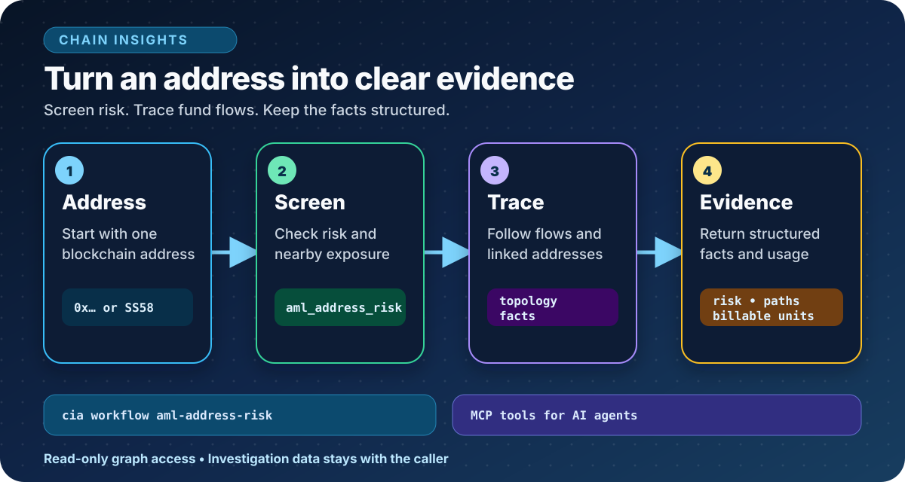
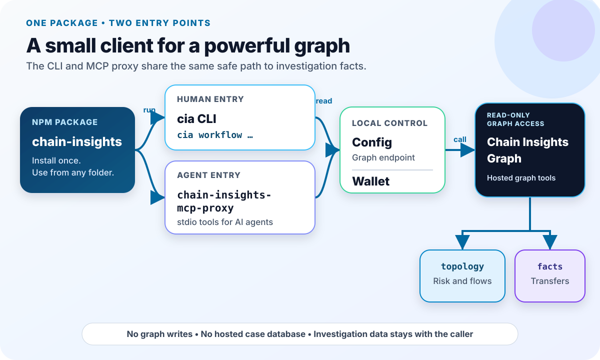

# Chain Insights

[](https://www.npmjs.com/package/chain-insights)
[](https://github.com/chainswarm/chain-insights/actions/workflows/verify.yml)
[](https://securityscorecards.dev/viewer/?uri=github.com/chainswarm/chain-insights)
[](https://github.com/chainswarm/chain-insights/blob/main/LICENSE)

[Website](https://chain-insights.ai) | [npm](https://www.npmjs.com/package/chain-insights)

Chain Insights is open-source AML and forensics infrastructure for AI agents
and analysts. It turns blockchain addresses and fund flows into clear,
structured investigation facts.



Every new account gets a free daily graph-query allowance.
No payment setup is needed for a first screen.

## Quickstart

Install the `cia` command-line interface (CLI), then screen one address.

```bash
npx chain-insights@latest --help
npm install -g chain-insights
cia networks
cia workflows
cia workflow aml-address-risk \
  --address 0xYourAddressHere \
  --network robinhood
```

Success means you see the network overview, workflow list, and address-risk
result.

Use `--json` when another tool needs indented JSON.

```bash
cia workflow aml-address-risk --json \
  --address 0xYourAddressHere \
  --network robinhood
```

The address-risk workflow uses the latest contract when `version` is omitted.
Pin the current contract with `--version v1`.

Connect the same tools to an AI agent.

```bash
cia setup claude-code
# Or: cia setup codex
# Or: cia setup hermes
```

## Purpose And Ownership

The public `chain-insights` npm package provides the `cia` CLI and a stdio
Model Context Protocol (MCP) proxy for Chain Insights Graph.

Owning group: chainswarm org, infra group.

## What It Does

### Owns

- The `cia` and `chain-insights` CLI commands.
- The `chain-insights-mcp-proxy` MCP server.
- High-level AML investigation workflows.
- Read-only graph and metadata tool access.
- Local configuration and an optional payment wallet.
- Reviewed `chain-insights-*` agent skills shipped in the npm package.

### Never Touches

- Blockchain indexing or graph database storage.
- Automatic risk labeling.
- Custodial wallets.
- Hosted case databases.
- Caller investigation data.

### What You Can Do Today

| Tool                        | Use it for                                                                   |
| --------------------------- | ---------------------------------------------------------------------------- |
| `aml_address_risk`          | Screen one address for risk, behavior, nearby context, and exchange exposure |
| `graph_query`               | Run one read-only query against a Chain Insights Graph layer                 |
| `graph_query_batch`         | Run related read-only queries as one MCP call                                |
| `meta_network_capabilities` | Check supported networks and tools                                           |
| `meta_usage_status`         | Check the caller's free daily allowance                                      |
| `meta_help`                 | Show tool and workflow guidance                                              |
| `wallet_balance`            | Show the local payment-wallet amount                                         |

Investigation results stay with the caller.
The CLI never writes labels or graph data.

## Dependencies

### Upstream

- **Chain Insights Graph MCP endpoint** supplies graph queries, AML
  primitives, and network metadata.
- **Base mainnet RPC** supports local wallet balance and payment only.

The default graph endpoint is `https://mcp.chain-insights.ai/`.

### Downstream

- Analysts use the `cia` CLI.
- AI agents use the MCP proxy.
- Scripts can use `--json` output or the package exports.

## Architecture



One npm package exposes two entry points.

- People use the `cia` CLI.
- Agents use `chain-insights-mcp-proxy` over stdio MCP.
- Both read local configuration and the optional wallet.
- Both call Chain Insights Graph without writing to it.

| Module        | Entrypoint          | Deeper documentation                                                     |
| ------------- | ------------------- | ------------------------------------------------------------------------ |
| Config        | `src/config`        | [Config component](docs/architecture/components/config.md)               |
| Federation    | `src/federation`    | [Federation component](docs/architecture/components/federation.md)       |
| Investigation | `src/investigation` | [Investigation component](docs/architecture/components/investigation.md) |
| MCP           | `src/mcp`           | [MCP component](docs/architecture/components/mcp.md)                     |
| Wallet        | `src/wallet`        | [Wallet component](docs/architecture/components/wallet.md)               |

Package entry points:

- `bin/cli.js` loads the built CLI for `cia` and `chain-insights`.
- `bin/mcp-proxy.cjs` loads the built stdio MCP proxy.
- `src/index.ts` defines the library exports.

See the [full architecture index](docs/architecture/ARCHITECTURE.md) for C4
diagrams, data contracts, and operating rules.

### Graph Access

Choose the read graph inside each query.

| Graph      | Use it for                                                                     |
| ---------- | ------------------------------------------------------------------------------ |
| `topology` | Address risk, labels, linked ownership, activity totals, and fund-flow paths   |
| `facts`    | Bounded individual transfers with amount, asset, transaction, and block fields |

The `network` argument selects the network.
It does not add an address filter to a topology query.

When a topology query does not match one exact address, scope the address
property yourself.
The `facts` graph uses one backing database per network, so its `Address`
nodes do not carry a `network` property.

Read [Graph query compatibility](docs/graph-query-compatibility.md) before
writing manual queries.

The package also includes these agent skills:

- `chain-insights-address-risk`
- `chain-insights-cypher`
- `chain-insights-schema-evm`
- `chain-insights-schema-bittensor`

### Billing: Billable Units

Chain Insights Graph bills by **billable units**.

- One returned row, node, or edge is one billable unit.
- Narrow queries cost less than broad queries.
- Every graph response reports `billable_units`.
- Workflow results also report `query_count` and `truncated_queries`.

Use `src/lib/recount-units.ts` to recount units in a response.

When a response has `truncated: true`:

- Add a smaller `LIMIT`.
- Add a tighter `WHERE` filter.
- Page with `SKIP` when you need the next batch.

## Prerequisites And Environment Setup

Use the repository root unless a command says otherwise.

- Linux with bash is the reference environment.
- macOS uses the same shell commands.
- Windows users should use Windows Subsystem for Linux (WSL).
- Node.js 22 or newer and npm are required.

Check the local tools.

```bash
node --version
npm --version
```

Success means Node prints version `22` or newer and npm prints a version.

`.env.example` documents the two supported environment overrides.

| Variable                            | Purpose                                                            |
| ----------------------------------- | ------------------------------------------------------------------ |
| `BASE_RPC_URL`                      | Optional Base RPC override for local wallet operations             |
| `CHAIN_INSIGHTS_GRAPH_MCP_ENDPOINT` | Optional graph endpoint override; remote hosts must use `https://` |

Never put real credentials in `.env.example`.

## Run

### Install The Released Package

Run from any directory.

```bash
npm install -g chain-insights
cia --version
cia update --check
```

Success means `cia --version` prints a semantic version.

Run a first screen.

```bash
cia workflow aml-address-risk \
  --address 0xYourAddressHere \
  --network robinhood
```

### Run From A Checkout

Run from the repository root.

```bash
npm install
npm run build
npm install -g .
cia --version
```

Success means the build exits with status `0` and `cia --version` matches
`package.json`.

### Use The Payment Wallet

Create a local wallet only when paid access is needed.

```bash
cia wallet create
```

The private key is shown once.
Save it in a password manager or offline backup.
Then type `BACKED UP` to finish.

The encrypted local copy lives at `~/.chain-insights/wallet.json`.
Continue with:

```bash
cia wallet ready
```

### Run Direct Graph Queries

Direct topology query:

```bash
cia mcp call graph_query \
  network=robinhood \
  "query=USE topology MATCH (a:Address) RETURN a.address AS address, a.network AS network, a.labels AS labels, a.risk_level AS risk_level LIMIT 10"
```

Related reads in one call:

```bash
cia mcp call graph_query_batch \
  network=robinhood \
  'queries=[{"id":"count","query":"USE topology MATCH (a:Address) RETURN count(a) AS count LIMIT 1"},{"id":"flows","query":"USE topology MATCH (src:Address)-[f:FLOWS_TO]->(dst:Address) RETURN src.address AS source, dst.address AS target, f.amount_usd_sum AS amount_usd_sum, f.tx_count AS tx_count LIMIT 3"},{"id":"linked","query":"USE topology MATCH (a:Address)-[l:LINKED]-(b:Address) RETURN a.address AS address, b.address AS linked_address, l.basis AS basis, l.confidence AS confidence LIMIT 3"},{"id":"node_metrics","query":"USE topology MATCH (a:Address {address:\"FULL_ADDRESS\"}) RETURN a.address AS address, a.tx_out_count AS tx_out_count, a.tx_in_count AS tx_in_count LIMIT 1"}]'
```

See [Graph tools](docs/graph-tools.md) for pagination and more focused reads.

## Configure

`cia` resolves `graphMcpEndpoint` in this order:

1. `CHAIN_INSIGHTS_GRAPH_MCP_ENDPOINT` environment variable.
2. Saved `graphMcpEndpoint` value.
3. Public default `https://mcp.chain-insights.ai/`.

The legacy `GRAPH_MCP_ENDPOINT` environment variable is also accepted.

Use the hosted default.

```bash
cia config set graphMcpEndpoint https://mcp.chain-insights.ai/
export CHAIN_INSIGHTS_GRAPH_MCP_ENDPOINT=https://mcp.chain-insights.ai/
```

Use the host root.
Do not add `/mcp`.

Use loopback only for local development.

```bash
cia config set graphMcpEndpoint http://127.0.0.1:8012/mcp
```

Validation rules:

- `http://` is accepted only for localhost and loopback addresses.
- Remote hosts must use `https://`.
- URLs with credentials, query strings, or fragments are rejected.

Hosted access also needs an approved access key or a prepared wallet.
See [MCP proxy](docs/mcp-proxy.md) for setup and access modes.

Check the current caller allowance.

```bash
cia mcp call meta_usage_status
```

## Test

Run the local gate from the repository root.

```bash
npm run typecheck
npm run build
npm test
npm run release:check
```

Success means every command exits with status `0`.
The release check is required for pull requests that change tracked product
files.

To reproduce the continuous integration install step:

```bash
npm ci --ignore-scripts --audit=false --fund=false
```

Continuous integration also checks lint, coverage, package metadata, type
resolution, and npm tarball contents.

## Debug

Read [Debugging](docs/debugging.md) for recovery steps and MCP Inspector use.

Structured MCP proxy logs live at:

```text
~/.chain-insights/runtime/logs/mcp-proxy.jsonl
```

Run these health checks from any directory after installing `cia`.

```bash
# Configured endpoint
cia config get graphMcpEndpoint

# User-facing network overview
cia networks

# Detailed Chain Insights capability matrix
cia mcp networks

# Caller allowance
cia mcp call meta_usage_status

# Fresh remote tool discovery
cia mcp tools --refresh

# Installed CLI sanity
cia --version && cia update --check
```

If a network or tool check fails:

1. Confirm the endpoint.
2. Confirm the access mode.
3. Refresh the remote tool list.
4. Retry the original command.

## Pre-staging / Release

Every pull request to `main` must:

- Bump `package.json`.
- Apply the same version to `package-lock.json`.
- Add the matching `CHANGELOG.md` entry.
- Pass the full verification gate.

Before a release, run the local gate and inspect the npm package contents.
Real publication uses the protected manual workflow and npm provenance.

See [Release discipline](docs/contributing.md#release-discipline) for the full
process and rollback guidance.

## Documentation Links

### Start Here

- [Graph tools](docs/graph-tools.md) — tools, graph layers, and query examples.
- [MCP proxy](docs/mcp-proxy.md) — agent setup, endpoint rules, and access modes.
- [Debugging](docs/debugging.md) — diagnostics and recovery.

### Architecture And Contracts

- [Architecture overview](docs/architecture.md) — product layers and data flow.
- [Architecture index](docs/architecture/ARCHITECTURE.md) — C4 diagrams and component depth.
- [Data contracts](docs/architecture/data-contracts.md) — stable tool and graph contracts.
- [Operating rules](docs/architecture/operating-rules.md) — repository invariants.
- [Acceptance evidence](docs/acceptance/) — component checks.

### Development And Support

- [Development](docs/development.md) — build, test, and local install.
- [Contributing](docs/contributing.md) — pull requests and release expectations.
- [Stability policy](docs/stability.md) — compatibility and deprecation rules.
- [Security policy](SECURITY.md) — supported versions and private reporting.
