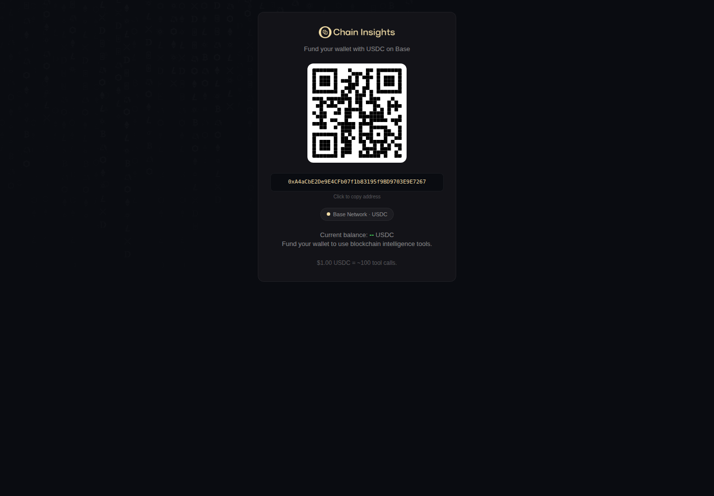
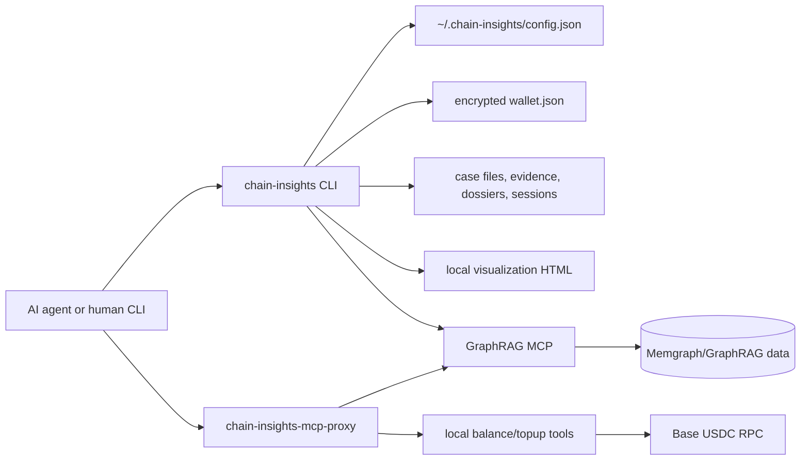

# Chain Insights

Local-first AML investigation tooling for AI agents. Chain Insights connects an investigator's terminal, case files, browser visualizations, and the live Chain Insights GraphRAG MCP into one repeatable workflow.

The toolkit is intentionally small at the edge: Node.js CLI, embedded DuckDB, flat case files, x402-ready MCP access, and browser artifacts that stay on the operator's machine.

## Table of Contents

1. [What This Is](#what-this-is)
2. [Current Capabilities](#current-capabilities)
3. [Quick Start](#quick-start)
4. [Configuration](#configuration)
5. [Visual Examples](#visual-examples)
6. [GraphRAG MCP Usage](#graphrag-mcp-usage)
7. [Wallet Balance and Top-Up](#wallet-balance-and-top-up)
8. [Cases, Evidence, Dossiers, and Sessions](#cases-evidence-dossiers-and-sessions)
9. [Playbooks](#playbooks)
10. [Money Flow Visualization](#money-flow-visualization)
11. [Agent MCP Proxy](#agent-mcp-proxy)
12. [Claude Desktop Setup](#claude-desktop-setup)
13. [Human UAT Smoke Test](#human-uat-smoke-test)
14. [Debug CLI Sketch](#debug-cli-sketch)
15. [Architecture](#architecture)
16. [Local Data and Security](#local-data-and-security)
17. [Development](#development)
18. [Troubleshooting](#troubleshooting)

## What This Is

Chain Insights is an open-source agent framework for crypto AML investigations. It gives Claude Code, Codex, and other MCP-capable agents a local investigation workspace:

- Discover and call the live Chain Insights GraphRAG MCP.
- Pay for production MCP calls through x402 on Base, or use a configured debug bearer token for local UAT.
- Keep case state, evidence, dossiers, sessions, and visualizations on disk.
- Run repeatable investigation playbooks tied to the real GraphRAG public tool surface.
- Top up and inspect the local Base USDC payment wallet.

The v1 scope is a local operator toolkit. It is not a hosted SaaS app, wallet custodian, chain indexer, or replacement for the GraphRAG MCP service.

## Current Capabilities

| Area | Status | Entry Points |
| --- | --- | --- |
| CLI and local server | Working | `chain-insights --help`, `chain-insights serve` |
| Claude Desktop setup | Working | `chain-insights setup claude-desktop` |
| MCP discovery and direct calls | Working | `chain-insights mcp tools`, `chain-insights mcp call` |
| x402/debug-token MCP auth | Working | `walletPrivateKey` or `mcpAuthToken` config |
| Local wallet balance and browser top-up | Working | `chain-insights wallet balance`, `chain-insights wallet topup` |
| Case lifecycle | Working | `chain-insights case open/list/activate/suspend/close` |
| Evidence and dossiers | Working | `chain-insights case evidence`, `chain-insights case dossier` |
| Session resume context | Working | `chain-insights case session`, `chain-insights case resume` |
| Money flow visualization | Working | `chain-insights viz` |
| Playbooks | Working | `chain-insights playbook run/list/show` |

Current known public GraphRAG tools:

| Tool | Purpose |
| --- | --- |
| `address_risk` | Risk and entity screening for an address |
| `track_funds` | Fund tracing from trusted/source addresses |
| `money_flows_between_exchanges` | Exchange-to-exchange flow analysis |
| `address_connection_risk` | Connection/path risk between addresses |
| `graph_query` | Direct Cypher query against the GraphRAG graph |

## Quick Start

From this repository:

```bash
npm install
npm run build
node bin/cli.js --help
```

Installed package usage:

```bash
chain-insights --help
chain-insights status
```

Configure the live GraphRAG MCP endpoint:

```bash
chain-insights config set mcpEndpoint http://localhost:8011/mcp
chain-insights config set mcpAuthToken "$GRAPHRAG_DEBUG_TOKEN"
chain-insights mcp tools --refresh
```

Run a real GraphRAG query:

```bash
chain-insights mcp call graph_query \
  network=bittensor \
  "query=MATCH (n) WHERE n.address IS NOT NULL RETURN labels(n) AS labels, n.address AS address LIMIT 10"
```

Example Bittensor address:

```text
5Ccmf1dJKzGtXX7h17eN72MVMRsFwvYjPVmkXPUaapczECf6
```

## Visual Examples

Chain Insights keeps wallet funding and graph exploration inside the local operator workflow.

Wallet top-up page:



Interactive money-flow graph with Force, Tree, and Reset controls:


MCP client view of the same graph application:


## Configuration

Configuration is stored in `~/.chain-insights/config.json` with `0600` permissions.

```bash
chain-insights config get mcpEndpoint
chain-insights config set mcpEndpoint http://localhost:8011/mcp
chain-insights config set mcpAuthToken "$GRAPHRAG_DEBUG_TOKEN"
```

Wallet private keys are intercepted before config write and stored encrypted in `~/.chain-insights/wallet.json`:

```bash
chain-insights config set walletPrivateKey 0xYOUR_EVM_PRIVATE_KEY
```

Supported config keys:

| Key | Purpose |
| --- | --- |
| `mcpEndpoint` | Remote GraphRAG MCP endpoint |
| `mcpAuthToken` | Debug/M2M bearer token for local GraphRAG UAT |
| `walletAddress` | Optional metadata field |
| `serverPort` | Local visualization server port |
| `dataDir` | Local Chain Insights data directory |
| `version` | Config schema version |

Optional environment variable:

```bash
BASE_RPC_URL=https://mainnet.base.org
```

`BASE_RPC_URL` is used by wallet balance and top-up balance refresh. If unset, the toolkit tries public Base RPC endpoints starting with `https://mainnet.base.org`.

## GraphRAG MCP Usage

List live remote tools:

```bash
chain-insights mcp tools --refresh
```

This prints the CLI tool table:

```text
Tool                            Description
------------------------------  ------------------------------------------------------------
address_risk                    Screens a blockchain address for risk: risk score with risk
track_funds                     Traces stolen funds from trusted (victim) addresses through
money_flows_between_exchanges   Traces fund flows between exchanges for one or more blockcha
address_connection_risk         Assesses the risk of a connection between two blockchain add
graph_query                     Execute a read-only Cypher query against the Memgraph graph
```

Table surfaces in this project:

| Table | Where it appears |
| --- | --- |
| README capability/tool/config tables | This README |
| Live MCP tool table | `chain-insights mcp tools --refresh` |
| MCP Inspector JSON tool list | `npx @modelcontextprotocol/inspector --cli ... --method tools/list` |

The live CLI table is intentionally a terminal view. The MCP proxy itself exposes the richer MCP tool metadata to Claude Desktop and other clients.

Call a tool directly:

```bash
chain-insights mcp call graph_query \
  network=bittensor \
  "query=MATCH (n) WHERE n.address IS NOT NULL RETURN labels(n) AS labels, n.address AS address LIMIT 10"
```

Inspect the remote MCP endpoint without Chain Insights:

```bash
npx @modelcontextprotocol/inspector \
  --cli http://localhost:8011/mcp \
  --transport http \
  --method tools/list
```

Auth behavior:

- If `mcpAuthToken` is set, Chain Insights sends both `X-MCP-Debug-Token` and `Authorization: Bearer <token>`.
- If `mcpAuthToken` is empty, Chain Insights uses the encrypted wallet private key with x402 payment handling.
- The schema cache lives at `~/.chain-insights/mcp-schema.json` and has a 24 hour TTL. Use `--refresh` to force a live schema fetch.

## Wallet Balance and Top-Up

Show the local payment wallet address:

```bash
chain-insights wallet address
```

Show Base USDC balance:

```bash
chain-insights wallet balance
```

Open a local browser top-up flow:

```bash
chain-insights wallet topup
```

Print the URL without opening a browser:

```bash
chain-insights wallet topup --no-open
```

Machine-readable output:

```bash
chain-insights wallet topup --json --no-open
```

The top-up page binds to `127.0.0.1` on a random local port and displays the payment wallet address, QR code, and current Base USDC balance. It does not request or store browser wallet private keys.

The Chain Insights MCP server also exposes local tools:

| Local Tool | Meaning |
| --- | --- |
| `balance` | Return local Chain Insights wallet address and Base USDC balance |
| `topup` | Start the local browser top-up server and return the URL |
| `case_open` | Create a local investigation case |
| `case_list` | List local investigation cases |
| `case_resume` | Load case context, evidence count, dossiers, and latest session |
| `case_add_evidence` | Append a report or note to the case evidence manifest |
| `case_verify_evidence` | Verify saved evidence integrity |
| `case_update_dossier` | Append a finding to an address/entity dossier |
| `case_start_session` | Start a local investigation session |
| `case_end_session` | End a session with findings and next steps |
| `help` | Show the Claude-facing Chain Insights tool surface |

These local tools are available to Claude Desktop and other MCP clients through the Chain Insights MCP server.

## Cases, Evidence, Dossiers, and Sessions

Open and manage a case:

```bash
chain-insights case open "Exchange deposit clustering" \
  --tags aml,bittensor \
  --description "Trace high-risk source funds into exchange entities"

chain-insights case list
chain-insights case activate <case-id>
chain-insights case suspend <case-id>
chain-insights case close <case-id>
```

Append evidence:

```bash
chain-insights case evidence add <case-id> \
  --source graph_query \
  --query-params "network=bittensor address=5Ccm..." \
  --content "$(cat result.json)"
```

Verify evidence integrity:

```bash
chain-insights case evidence verify <case-id>
```

Maintain an entity dossier:

```bash
chain-insights case dossier update <case-id> 5Ccmf1dJKzGtXX7h17eN72MVMRsFwvYjPVmkXPUaapczECf6 \
  --type unknown \
  --finding "Appears in live GraphRAG address sample; continue risk screening."
```

Manage sessions and restore context:

```bash
chain-insights case session start <case-id>
chain-insights case session end <case-id> \
  --findings "Initial graph query returned miner and address nodes." \
  --next-steps "Run address_risk and track_funds."
chain-insights case resume <case-id>
```

## Playbooks

List built-ins:

```bash
chain-insights playbook list
```

Show a playbook before running it:

```bash
chain-insights playbook show risk-check
```

Run an address risk check:

```bash
chain-insights playbook run risk-check \
  -p address=5Ccmf1dJKzGtXX7h17eN72MVMRsFwvYjPVmkXPUaapczECf6 \
  -p network=bittensor
```

Run a trace playbook and attach evidence to a case:

```bash
chain-insights playbook run trace-funds \
  --case <case-id> \
  -p address=5Ccmf1dJKzGtXX7h17eN72MVMRsFwvYjPVmkXPUaapczECf6 \
  -p network=bittensor
```

Dry-run before spending MCP calls:

```bash
chain-insights playbook run trace-funds \
  -p address=5Ccmf1dJKzGtXX7h17eN72MVMRsFwvYjPVmkXPUaapczECf6 \
  --dry-run
```

Built-in playbooks validate their tool names against the live MCP schema before execution. This is the guardrail that prevents stale or hallucinated playbooks from running against nonexistent tools.

## Money Flow Visualization

Generate an ad hoc visualization from a JSON file:

```bash
chain-insights viz --data ./sample-transactions.json
```

Generate a visualization for a case:

```bash
chain-insights viz <case-id>
```

The CLI writes self-contained HTML under `~/.chain-insights/viz/` or `~/.chain-insights/cases/<case-id>/viz/`, starts the local server, and opens the browser.

## Agent MCP Proxy

Use the stdio proxy when an AI agent should consume Chain Insights as an MCP server:

```json
{
  "mcpServers": {
    "chain-insights": {
      "command": "chain-insights-mcp-proxy"
    }
  }
}
```

The proxy:

- Connects to the configured remote GraphRAG MCP endpoint.
- Uses debug bearer auth or x402 payment auth according to local config.
- Caches remote tool schemas for 24 hours.
- Exposes public Chain Insights investigation tools to the local MCP client.
- Adds local wallet and case workflow tools.
- Provides MCP server instructions with the investigation workflow, required argument rules, and graph query schema hints.

The proxy also normalizes GraphRAG tool results before local agents see them:

- LLM-visible `content` remains markdown/text only.
- `structuredContent` carries compact `chain-insights.result.v1` facts.
- Graph widget data is extracted from remote `_meta.chainInsights.graph.data`.
- Graph data is written to `~/.chain-insights/artifacts/<id>/graph.json`.
- The returned tool result contains only `_meta.chainInsights.graph.url` for the local graph app.
- The local artifact server is started automatically when a graph-backed MCP result returns an artifact URL.

## Claude Desktop Setup

Configure Claude Desktop from the Chain Insights CLI:

```bash
chain-insights setup claude-desktop --dry-run
chain-insights setup claude-desktop
```

The setup command updates only the `mcpServers.chain-insights` entry in `claude_desktop_config.json`, preserves existing preferences and other MCP servers, and writes a backup before changing an existing config.

Claude Desktop does not hot-reload this file. Fully quit and reopen Claude Desktop after running setup. If the desktop UI still shows `/home/aphex5/.local/bin/chain-insights-mcp start`, the app is still using the old in-memory server entry from before setup.

On Linux, restart Claude Desktop from the terminal:

```bash
pkill -f claude-desktop
nohup /usr/bin/claude-desktop >/tmp/claude-desktop.log 2>&1 &
```

Then confirm Claude Desktop relaunched and check the Chain Insights MCP log:

```bash
pgrep -af claude-desktop
tail -80 ~/.config/Claude/logs/mcp-server-chain-insights.log
```

Equivalent manual config shape:

```json
{
  "mcpServers": {
    "chain-insights": {
      "command": "/absolute/path/to/node",
      "args": ["/absolute/path/to/chain-insights/bin/mcp-proxy.cjs"]
    }
  }
}
```

Validate the configured Claude Desktop entry without opening Claude:

```bash
npx @modelcontextprotocol/inspector \
  --cli \
  --config ~/.config/Claude/claude_desktop_config.json \
  --server chain-insights \
  --method tools/list

npx @modelcontextprotocol/inspector \
  --cli \
  --config ~/.config/Claude/claude_desktop_config.json \
  --server chain-insights \
  --method resources/list
```

To check whether a desktop process was already running before setup:

```bash
pgrep -af claude-desktop
```

Expected MCP app resources:

| Resource | Purpose |
| --- | --- |
| `ui://chain-insights/topup.html` | Wallet top-up app |
| `ui://chain-insights/graph` | Interactive money-flow graph |

Claude Desktop prompt shortcuts:

| Prompt | Use |
| --- | --- |
| `address-risk` | Screen an address for AML risk and neighborhood context |
| `track-funds` | Trace victim funds through intermediaries to exchanges |
| `money-flows-between-exchanges` | Find exchange deposits and withdrawals for addresses |
| `address-connection-risk` | Assess whether two addresses are connected through risky paths |
| `graph-query` | Run a read-only Cypher query against the investigation graph |
| `balance` | Show the local Base USDC payment wallet balance |
| `topup` | Open the wallet top-up page |
| `open-investigation-case` | Create a local case |
| `resume-investigation-case` | Load local case context |
| `save-investigation-evidence` | Save a tool result or note as case evidence |
| `help` | Show Chain Insights tools and case workflow |

### Claude Desktop Investigation Workflow

Use this flow when Claude Desktop is driving an investigation:

1. Start with a case.
   - New investigation: ask Claude to use `case_open`.
   - Existing investigation: ask Claude to use `case_list`, then `case_resume` with the selected `case_id`.
2. Provide the network explicitly. Public investigation tools require `network`; supported values are `bittensor`, `ethereum`, and `base`. If the user omits it, Claude should ask instead of guessing.
3. Pick the tool by question:
   - Single address risk: `address_risk`.
   - Victim/source fund tracing: `track_funds`.
   - Exchange deposits and withdrawals without a victim/scammer distinction: `money_flows_between_exchanges`.
   - Two-address connection/path risk: `address_connection_risk`.
   - Custom read-only Cypher or aggregate counts: `graph_query`.
4. Preserve material results:
   - Use `case_add_evidence` after reports, traces, graph queries, or analyst notes that should remain in the case record.
   - Use `case_update_dossier` for durable findings about an address or entity.
   - Use `case_start_session` and `case_end_session` for investigation session notes and next steps.
5. Use `balance` to check the local payment wallet and `topup` to open the Base USDC funding page.

The Chain Insights MCP server publishes this workflow in its server instructions, so Claude receives it when the server starts. Required arguments are also present in tool schemas; if a client still calls a public tool without `network`, Chain Insights rejects the call before execution.

### Graph Query Schema Hints

These hints were verified with `graph_query` against `network=bittensor` on 2026-05-12. Treat them as a starting point and use the schema discovery queries below when writing custom Cypher.

Common node labels:

```text
Address
Miner
Validator
Hotkey
Exchange
```

Common `Address` properties:

```text
address
network
address_type
total_volume_usd
total_in_usd
total_out_usd
net_flow_usd
degree_in
degree_out
tx_in_count
tx_out_count
first_activity_timestamp
last_activity_timestamp
```

Risk and graph-science properties may include:

```text
ml_risk_score
ml_risk_level
ml_top_drivers
ml_pattern_summary
ml_pagerank
ml_betweenness
ml_community_id
```

Common relationship types:

```text
FLOWS_TO
OPERATED_FROM
SERVED_FROM
REGISTERED_NEURON
BELONGS_TO
SYBIL_CLUSTER
LAYERING_HOP
BURST_ACTIVITY
CYCLE_PARTICIPANT
SMURFING_CLUSTER
```

`FLOWS_TO` is aggregated and commonly carries:

```text
amount_sum
amount_usd_sum
tx_count
dominant_asset
first_seen_timestamp
last_seen_timestamp
first_tx_id
last_tx_id
```

Node schema discovery:

```cypher
MATCH (n)
WHERE n.address IS NOT NULL
RETURN labels(n) AS labels, keys(n) AS properties, count(*) AS count
ORDER BY count DESC
LIMIT 20
```

Relationship schema discovery:

```cypher
MATCH ()-[r]->()
RETURN type(r) AS relationship, keys(r) AS properties, count(*) AS count
ORDER BY count DESC
LIMIT 20
```

`graph_query` is read-only. Do not use `CREATE`, `MERGE`, `SET`, `DELETE`, `REMOVE`, `DROP`, or `DETACH`.

Useful Claude Desktop prompts:

```text
Use Chain Insights to show my payment wallet balance.
```

```text
Use Chain Insights to open the wallet top-up page.
```

```text
Use Chain Insights to open an investigation case named "Exchange deposit clustering" with tags aml,bittensor.
```

```text
Use Chain Insights to run address_risk on network bittensor for 5Ccmf1dJKzGtXX7h17eN72MVMRsFwvYjPVmkXPUaapczECf6. Show the report exactly and open the graph visualization if available.
```

```text
Use Chain Insights address_connection_risk on network bittensor with from_address 5GTjfJaLpBNrgybhY24NqhDnKW9r94z72RSYLxeodxJfSkj5 and to_address 5Df97gT4omdxrwckBKs2AekbBB66fDNA6VRKR46J2iSmJGgd.
```

```text
Use Chain Insights graph_query on network bittensor with:
MATCH (n) WHERE n.address IS NOT NULL RETURN labels(n) AS labels, n.address AS address LIMIT 10
```

```text
Use Chain Insights to save the last address_risk report as evidence in case 20260512_001_exchange-deposit-clustering.
```

Claude Desktop should see the markdown report as tool content and render the app iframe from the tool's `ui.resourceUri`. For graph-backed tools, Chain Insights stores the raw graph payload locally and sends the iframe only a local artifact URL in `_meta.chainInsights.graph.url`.

## Human UAT Smoke Test

Use this sequence after a fresh build or install:

```bash
npm run build
node bin/cli.js --help
node bin/cli.js wallet --help
node bin/cli.js config set mcpEndpoint http://localhost:8011/mcp
node bin/cli.js config set mcpAuthToken "$GRAPHRAG_DEBUG_TOKEN"
node bin/cli.js mcp tools --refresh
node bin/cli.js mcp call graph_query \
  network=bittensor \
  "query=MATCH (n) WHERE n.address IS NOT NULL RETURN labels(n) AS labels, n.address AS address LIMIT 10"
node bin/cli.js wallet address
node bin/cli.js wallet balance
node bin/cli.js wallet topup --no-open
```

Expected results:

- CLI help lists `status`, `setup`, `config`, `mcp`, `wallet`, `case`, `playbook`, and `viz`.
- `mcp tools --refresh` lists the live GraphRAG tools.
- `graph_query` returns real Memgraph rows.
- `wallet balance` prints the local payment wallet and Base USDC balance.
- `wallet topup --no-open` prints a `127.0.0.1` URL and keeps the top-up server running until `Ctrl+C`.

GraphRAG/Chain Insights UAT skill:

```bash
skills/test-chain-insights-graphrag-mcp/scripts/run-uat.sh
```

The skill builds or reuses local artifacts, calls the real GraphRAG MCP endpoint, runs the Chain Insights proxy, verifies graph artifacts are stored under `~/.chain-insights/artifacts/<id>/graph.json`, and writes a timestamped report under `.tmp/uat/`.

## Debug CLI Sketch

Implemented today:

```bash
chain-insights setup claude-desktop --dry-run
chain-insights setup claude-desktop
```

Proposed next diagnostic surface:

```bash
chain-insights debug
chain-insights debug mcp
chain-insights debug claude-desktop
chain-insights debug artifacts <artifact-id>
chain-insights debug browser --artifact <artifact-id>
```

Expected checks:

| Command | Checks |
| --- | --- |
| `debug` | Config path, data dir, wallet presence, schema cache age, local server URL |
| `debug mcp` | Remote endpoint reachability, auth mode, `tools/list`, local proxy `tools/list`, local proxy `resources/list` |
| `debug claude-desktop` | Claude config path, `chain-insights` server entry, command/args existence, Inspector smoke test |
| `debug artifacts <id>` | Artifact file exists, schema is `chain-insights.graph.v1`, node/edge/flow counts, local server fetch works |
| `debug browser --artifact <id>` | Opens the local graph app and verifies it can load `_meta.chainInsights.graph.url` |

Rules for the debug CLI:

- Redact `mcpAuthToken` and never print wallet private keys.
- Do not perform paid production MCP calls unless the operator passes an explicit `--live-call` flag.
- Default output should be human-readable; add `--json` for CI and scripted UAT.
- Prefer exact failure causes over generic health summaries.

## Architecture



Primary modules:

| Module | Responsibility |
| --- | --- |
| `src/cli.ts` | Commander CLI and command routing |
| `src/config/` | Local config schema and storage |
| `src/wallet/` | Encrypted EVM wallet, Base USDC balance, browser top-up |
| `src/mcp/` | x402/debug-token MCP client, schema cache, stdio proxy |
| `src/cases/` | Case state, evidence, dossiers, sessions |
| `src/playbooks/` | Markdown playbook parser, built-ins, runner |
| `src/viz/` | D3 graph data model and self-contained HTML generation |
| `src/server/` | Local Hono server for visualization artifacts |

## Local Data and Security

Local data defaults to `~/.chain-insights/`:

| Path | Contents |
| --- | --- |
| `config.json` | MCP endpoint, auth token, server port, data dir |
| `wallet.json` | AES-256-GCM encrypted EVM private key |
| `mcp-schema.json` | 24 hour cached remote MCP tool schema |
| `chain-insights.duckdb` | Embedded case database |
| `cases/<case-id>/` | Case metadata, evidence, dossiers, sessions, visualizations |
| `viz/` | Ad hoc visualization HTML |

Security properties:

- Wallet private keys are never written to `config.json`.
- `wallet.json`, `config.json`, and `mcp-schema.json` are written with owner-only permissions.
- Investigation data stays local; there is no telemetry or cloud sync.
- The top-up server binds to `127.0.0.1`.
- Production x402 spends should use a hot wallet with limited funds.

## Development

Required runtime:

- Node.js 22+
- npm

Useful commands:

```bash
npm install
npm run typecheck
npm test
npm run build
```

Focused tests for MCP and wallet work:

```bash
npx vitest run \
  tests/wallet.test.ts \
  tests/wallet-tools.test.ts \
  tests/topup-server.test.ts \
  tests/mcp-client.test.ts \
  tests/mcp-proxy.test.ts \
  tests/cli.test.ts
```

If DuckDB native bindings break after switching Node versions:

```bash
npm rebuild @duckdb/node-api
```

## Troubleshooting

### `Wallet not configured and mcpAuthToken is empty`

Set a debug token for local GraphRAG UAT:

```bash
chain-insights config set mcpAuthToken "$GRAPHRAG_DEBUG_TOKEN"
```

Or configure a funded x402 payment wallet:

```bash
chain-insights config set walletPrivateKey 0xYOUR_EVM_PRIVATE_KEY
chain-insights wallet topup
```

### `chain-insights mcp tools` is stale

Force schema refresh:

```bash
chain-insights mcp tools --refresh
```

### `wallet balance` cannot reach Base RPC

Set a reliable Base RPC URL:

```bash
BASE_RPC_URL=https://mainnet.base.org chain-insights wallet balance
```

### Top-up page balance is unavailable

The page reads balance through the local top-up server. If it shows an unavailable balance, retry with a reliable Base RPC URL:

```bash
BASE_RPC_URL=https://base-rpc.publicnode.com chain-insights wallet topup
```

### Playbook refuses to run because a tool is unavailable

Refresh the live MCP schema and inspect the current tool list:

```bash
chain-insights mcp tools --refresh
chain-insights playbook show <playbook>
```

The runner fails closed when a playbook references a tool that is not present in the live GraphRAG schema.
