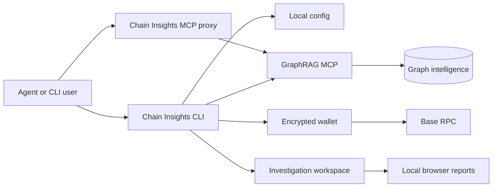

# Architecture

Chain Insights is a local investigation framework around a remote graph
execution endpoint. It keeps sensitive workspace outputs as normal local files
and leaves graph computation to the configured GraphRAG MCP backend.

## Product Layers



The CLI is the operator entry point. The MCP proxy exposes the same local
framework to AI agents. The GraphRAG MCP endpoint executes graph-language reads
against live topology, archive topology, and facts.

## Module Responsibilities

| Module area | Responsibility |
| --- | --- |
| CLI | Command routing and user-facing workflows |
| Config | Local config schema and owner-only storage |
| Wallet | Encrypted EVM wallet and Base USDC balance checks |
| MCP client/proxy | x402, debug-token, test-key auth, schema cache, stdio proxy |
| Cases | Case state, evidence, dossiers, sessions |
| Playbooks | Legacy playbook runner and migration boundary |
| Visualization | Graph data model and self-contained HTML generation |
| Server | Local report and visualization server |
| Workspace init | Investigation workspace scaffold and runtime schema notes |

## Data Flow

1. The user or agent works inside an initialized investigation workspace.
2. Chain Insights reads local config for endpoint and auth mode.
3. Graph queries go to the configured GraphRAG MCP endpoint.
4. The graph backend executes against `live_topology`, `archive_topology`, or
   `facts`.
5. Chain Insights stores compact evidence, graph JSON, HTML reports, CSVs, and
   summaries in the active workspace.
6. Case evidence references report files instead of embedding large payloads.

## Config

Configuration is stored in `~/.chain-insights/config.json` with owner-only
permissions.

Primary GraphRAG MCP config:

```bash
chain-insights config get graphMcpEndpoint
chain-insights config set graphMcpEndpoint https://staging-mcp.chain-insights.ai/mcp
export CHAIN_INSIGHTS_GRAPH_MCP_ENDPOINT=https://staging-mcp.chain-insights.ai/mcp
```

The runtime default is local loopback: `http://127.0.0.1:8012/mcp`. Hosted
endpoints are operator configuration, not hardcoded package defaults.

Supported config keys:

| Key | Purpose |
| --- | --- |
| `graphMcpEndpoint` | GraphRAG MCP endpoint used by CLI and proxy |
| `graphMcpAuthToken` | GraphRAG MCP bearer credential for test access keys or local debug UAT |
| `mcpEndpoint` | Legacy endpoint fallback |
| `mcpAuthToken` | Legacy debug token fallback |
| `walletAddress` | Optional wallet metadata |
| `serverPort` | Local visualization and graph report server port |
| `dataDir` | Local Chain Insights data directory |
| `version` | Config schema version |

Wallet private keys are intercepted before config write and stored encrypted in
`~/.chain-insights/wallet.json`.

## Local Data

Default local data directory:

```text
~/.chain-insights/
  config.json
  wallet.json
  mcp-schema-*.json
  chain-insights.duckdb
```

Investigation outputs belong in initialized workspaces, not in the global data
directory.

Workspace outputs include:

```text
cases/
imports/
reports/
reports/graphs/
reports/tables/
templates/
.chain-insights/schema/
.chain-insights/runtime/
.chain-insights/runtime-skill/
```

## Security Model

- `wallet.json`, `config.json`, and schema cache files use owner-only
  permissions.
- Wallet private keys are encrypted with AES-256-GCM.
- Debug bearer tokens are redacted in CLI output.
- Test access keys are payment bypass credentials.
- Production x402 should use a hot wallet with limited funds.
- Graph report JSON is stored in the active workspace and served from
  `127.0.0.1`.
- Chain Insights does not custody user funds.
- CI runs typecheck, tests, build, npm package packing, vulnerability audit,
  registry signature verification, secret-pattern scanning, CodeQL, OpenSSF
  Scorecard, and Dependabot updates.

## Test Access Keys

Invited testers can use server-side test keys without x402 payment:

```bash
chain-insights access-key set ci_test_REDACTED --endpoint https://staging-mcp.chain-insights.ai/mcp
chain-insights access-key status
chain-insights mcp call graph_query network=bittensor query='USE live_topology MATCH (n) RETURN n LIMIT 1'
```

Operators configure the server with `MCP_TEST_ACCESS_KEY_HASHES`, a
comma-separated list of `key_id:sha256(full_key)` entries:

```bash
export TEST_KEY="ci_test_$(openssl rand -hex 24)"
printf '%s' "$TEST_KEY" | sha256sum
export MCP_TEST_ACCESS_KEY_HASHES="partner-a:<sha256-from-command>"
```

Share the raw `ci_test_...` key once. Store only its SHA-256 hash in deployment
config. Revoke by removing the entry and redeploying GraphRAG MCP.
