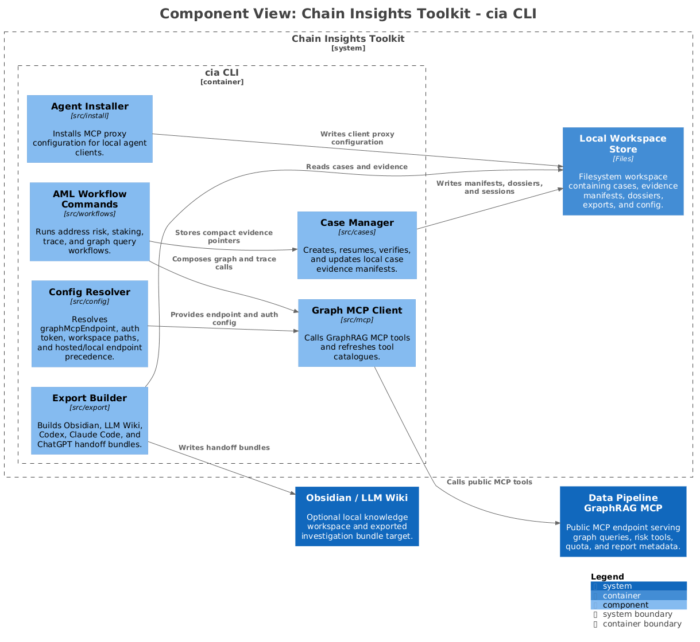
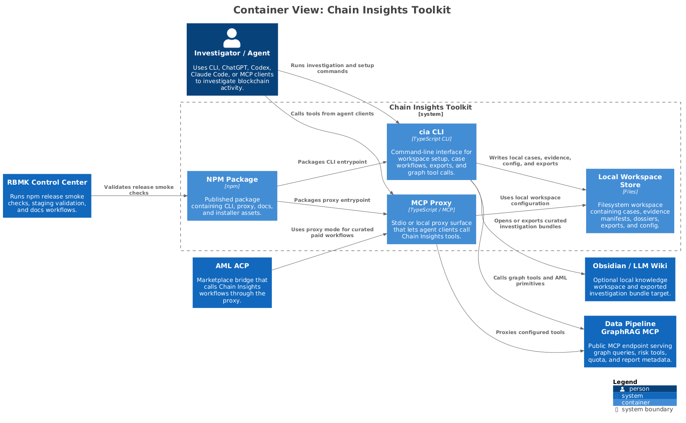
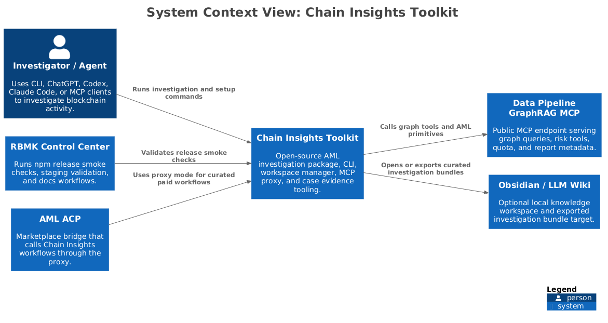

# chain-insights Architecture

[Website](https://chain-insights.ai) | [npm](https://www.npmjs.com/package/chain-insights)

> Depth lives in authored docs under `context/`, `containers/`, `components/`, and `acceptance/`. This file is a regenerable index.

## Context

- [overview](context/overview.md) — purpose, bounded context, external systems

- [data flow](context/data-flow.md) — end-to-end pipeline

- [dependencies](context/dependencies.md) — contracts with indexers / ml-pipeline / rbmk / chain-insights

## Containers

- [cia CLI](containers/cia-cli.md) — Command-line interface for workspace setup, case workflows, exports, and graph tool calls.

- [MCP Proxy](containers/mcp-proxy.md) — Stdio or local proxy surface that lets agent clients call Chain Insights tools.

- [Local Workspace Store](containers/local-workspace-store.md) — Filesystem workspace containing cases, evidence manifests, dossiers, exports, and config.

- [NPM Package](containers/npm-package.md) — Published package containing CLI, proxy, docs, and installer assets.

## Components

One doc per `cmd/` worker under `components/`. Generator-owned header, human-owned body (Reads/Writes/Flow/Invariants/Run/Verify).

| Worker | Component doc |
|---|---|
| `config` | [config](components/config.md) |
| `investigation` | [investigation](components/investigation.md) |
| `mcp` | [mcp](components/mcp.md) |
| `server` | [server](components/server.md) |
| `viz` | [viz](components/viz.md) |
| `wallet` | [wallet](components/wallet.md) |

## C4 Diagrams

### structurizr-chain-insights-components

[vector SVG](diagrams/rendered/global/structurizr-chain-insights-components.svg) · [PNG](diagrams/rendered/global/structurizr-chain-insights-components.png)

See [context/overview.md](context/overview.md) for context.

### structurizr-chain-insights-containers

[vector SVG](diagrams/rendered/global/structurizr-chain-insights-containers.svg) · [PNG](diagrams/rendered/global/structurizr-chain-insights-containers.png)

See [context/overview.md](context/overview.md) for context.

### structurizr-chain-insights-context

[vector SVG](diagrams/rendered/global/structurizr-chain-insights-context.svg) · [PNG](diagrams/rendered/global/structurizr-chain-insights-context.png)

See [context/overview.md](context/overview.md) for context.

## Verification

- `npm test`

- `npm run build`
