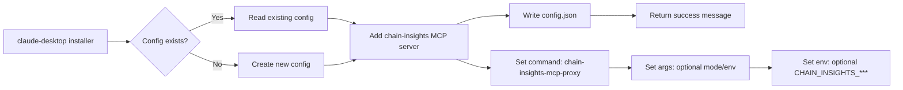

<!-- gsd: deterministic header -->
Worker: claude-desktop
Entrypoint: src/claude-desktop
Package: claude-desktop
Language: typescript
Tests: (none detected)
<!-- /gsd: deterministic header -->

# claude-desktop

## Purpose

Agent installer component that configures Claude Desktop to use Chain Insights MCP proxy. Writes Claude Desktop config.json (MCP servers section), validates Claude Desktop config path, and provides installation guidance. This component is minimal; the primary Claude integration happens via MCP protocol from the stdio proxy.

## Reads

- **Claude Desktop config path:** Platform-specific location (~/Library/Application Support/Claude/claude_desktop_config.json on macOS, %APPDATA%\Claude\claude_desktop_config.json on Windows)
- **~/.chain-insights/config.json:** Chain Insights configuration (graphMcpEndpoint, workspace paths)

## Writes

- **Claude Desktop config.json:** MCP server entry for chain-insights proxy (command, args, env vars)
- **Console/stdout:** Installation success message, config path, next steps

## Flow



## Invariants

- **Platform-specific paths:** Config location varies by OS (macOS vs Windows vs Linux)
- **MCP server entry format:** {command: "chain-insights-mcp-proxy", args: [], env: {CHAIN_INSIGHTS_***: "..."}}
- **No destructive edits:** Installer adds chain-insights entry without modifying existing MCP servers
- **Idempotent:** Running installer twice is safe (detects existing entry, skips duplicate)
- **Command availability:** chain-insights-mcp-proxy must be in PATH (global npm install or local ./bin/)

## Run

```bash
# Install Chain Insights for Claude Desktop (CLI)
cia claude install
# → Detects platform, reads/writes Claude Desktop config, adds MCP server entry

# Install with custom configuration
cia claude install --mode stateless --endpoint https://staging-mcp.chain-insights.ai/mcp
# → Adds env vars to MCP server entry (CHAIN_INSIGHTS_MCP_PROXY_MODE, CHAIN_INSIGHTS_GRAPH_MCP_ENDPOINT)

# Verify installation
cat ~/Library/Application\ Support/Claude/claude_desktop_config.json | jq '.mcpServers.chain-insights'
# Should show command, args, env configuration
```

## Verify

```bash
# Test config detection (macOS)
ls -la ~/Library/Application\ Support/Claude/claude_desktop_config.json
# Should exist after Claude Desktop first run

# Test MCP server entry (after install)
cat ~/Library/Application\ Support/Claude/claude_desktop_config.json | jq '.mcpKeys' | grep chain-insights
# Should include "chain-insights"

# Test command availability
which chain-insights-mcp-proxy
# Should return /usr/local/bin/chain-insights-mcp-proxy or similar

# Test Claude Desktop integration
# Restart Claude Desktop, open MCP settings, should see "chain-insights" server listed
```
