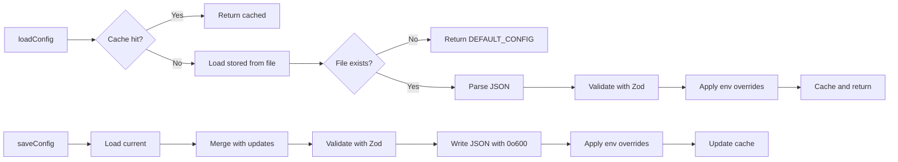

<!-- gsd: deterministic header -->
Worker: config
Entrypoint: src/config
Package: config
Language: typescript
Tests: (none detected)
<!-- /gsd: deterministic header -->

# config

## Purpose

Manages Chain Insights user configuration: graph MCP endpoint, authentication tokens, workspace paths, and runtime mode flags. Provides load/save APIs with Zod schema validation, environment variable overrides, and cached reads for performance.

## Reads

- **~/.chain-insights/config.json:** Stored user configuration (graphMcpEndpoint, mcpAuthToken, graphMcpAuthToken, graphMcpMode, dataDir, serverPort)
- **CHAIN_INSIGHTS_GRAPH_MCP_ENDPOINT env var:** Optional override for graph endpoint (GRAPH_MCP_ENDPOINT legacy alias also supported)
- **DEFAULT_CONFIG constant:** Fallback defaults when config.json is absent

## Writes

- **~/.chain-insights/config.json:** Updated via `cia config set` or `cia access-key set` (writes with 0o600 permissions)
- **In-memory cache:** _cached variable holds resolved config until resetConfigCache() is called

## Flow



## Invariants

- Config path is always ~/.chain-insights/config.json (derived from HOME at call time for testability)
- Environment variable CHAIN_INSIGHTS_GRAPH_MCP_ENDPOINT overrides saved graphMcpEndpoint (not vice versa)
- Invalid JSON or schema validation throws human-readable error with config file path
- Empty config.json (ENOENT) returns DEFAULT_CONFIG, does not throw
- Saved config is always complete (merge-on-update, never partial)
- File writes use mode 0o600 (owner read/write only)
- Cache is invalidated by resetConfigCache() (used after external config changes)

## Run

```bash
# Load current config (from CLI, MCP proxy, or tools)
cia config get graphMcpEndpoint
# → Calls loadConfig(), reads config.json, applies env overrides, returns value

# Set config value
cia config set graphMcpEndpoint https://staging-mcp.chain-insights.ai/mcp
# → Calls saveConfig({graphMcpEndpoint: ...}), validates, writes, updates cache

# Set access key
cia access-key set test-key-abc123
# → Calls saveConfig({mcpAuthToken: ...}) or saveConfig({graphMcpAuthToken: ...})
```

## Verify

```bash
# Manual verification
cat ~/.chain-insights/config.json
# Should contain: graphMcpEndpoint, dataDir, serverPort, optional auth tokens

# Test env override
export CHAIN_INSIGHTS_GRAPH_MCP_ENDPOINT=http://localhost:9999/mcp
cia config get graphMcpEndpoint
# Should return http://localhost:9999/mcp despite saved value

# Test permissions
ls -la ~/.chain-insights/config.json
# Should show -rw------- (0o600)
```
