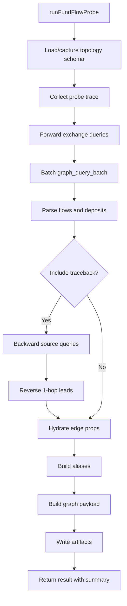

Worker: investigation
Entrypoint: src/investigation
Package: investigation
Language: typescript
Tests: (none detected)

# investigation

## Purpose

Implements AML investigation workflows: address risk screening, victim/suspect/deposit fund tracing, and evidence artifact generation. Orchestrates graph queries (forward/backward topology traversal, fact lookups), builds compact evidence (alias mapping, fund flows, traceback results), writes workspace artifacts (Markdown reports, graph JSON/HTML, table CSV/HTML, compact evidence JSON), and returns continuation hints for follow-up tools.

## Reads

- **Remote MCP Client:** Calls Chain Insights Graph tools (graph_query, graph_query_batch) via proxy client
- **Workspace output paths:** Reads/creates workspace directory structure (reports/graphs/, reports/tables/, artifacts/, schema/)
- **Investigation config:** seed addresses, network, max hops, min amount sum, activity window, evidence source

## Writes

- **Workspace schema files:** <network>.graph-schema.json (runtime topology schema: node labels, relationship types, property keys)
- **Compact evidence JSON:** <timestamp>_<address>.compact-evidence.json (alias map, fund flows, deposits, source matches, reverse leads)
- **Graph JSON/HTML:** <timestamp>_<address>.graph.json and .graph.html (nodes, edges, flow metadata, graph app view)
- **Table CSV/HTML:** <timestamp>_<address>.flows.csv and .table.html (hop-by-hop flow table with amounts and timestamps)
- **Report Markdown:** <timestamp>_<address>.trace-report.md (summary, Mermaid diagram, file references, continuation hint)

## Flow



## Invariants

- **Bounded tracing:** maxHops clamped to 1-5, perAddressLimit clamped to 1-10, minAmountSum >= 0
- **Exchange terminal rule:** Traversal stops at exchange nodes (is_exchange IS NOT NULL); no expansion through exchanges
- **Address normalization:** All blockchain addresses preserved as full strings (no truncation, no ellipsis)
- **Activity window predicates:** Optional fromTimestamp/toTimestamp filters edge timestamps in Cypher queries
- **Alias mapping:** V (victim/seed), D (deposit), I (intermediate), E (exchange), X (source exchange), L (reverse lead)
- **Compact evidence:** Aliases compacted (max 20 intermediaries, sources, leads) for structuredContent; full addressMap in artifacts
- **Stateless proxy mode:** When writeArtifacts=false, returns summary + structuredContent without workspace writes
- **Traceback warnings:** Deposit traceback failures collected and returned (do not fail entire trace)

## Run

```bash
# Trace victim funds (CLI)
cia mcp call trace-victim-funds \
  --network bittensor \
  --victim-addresses 5GTjfJaLpBNrgybhY24NqhDnKW9r94z72RSYLxeodxJfSkj5 \
  --max-hops 3
# → Calls runFundFlowProbe(), writes artifacts to active workspace, returns summary

# Trace suspect funds (MCP tool call)
{
  "name": "aml_trace_suspect_funds",
  "arguments": {
    "network": "bittensor",
    "suspect_addresses": ["0xabc..."],
    "max_hops": 4,
    "incident_timestamp": 1704067200000
  }
}
# → Runs traceSuspectFunds(), deposits/sources/leads flows, writes artifacts
```

## Verify

```bash
# Manual trace execution
cia mcp call trace-victim-funds --network bittensor --victim-addresses 0xtest...
# Check workspace artifacts:
ls -la reports/ reports/graphs/ reports/tables/
# Should show timestamped files: *.trace-report.md, *.graph.json, *.graph.html, *.flows.csv, *.table.html, *.compact-evidence.json

# Verify compact evidence structure
cat reports/tables/*.compact-evidence.json | jq '.schema, .source, .network, .address_map, .fund_flows'
# Should contain chain-insights.probe_evidence.v1, alias mappings, flow paths

# Verify graph payload
cat reports/graphs/*.graph.json | jq '.schema, .nodes | length, .edges | length'
# Should contain chain-insights.graph.v1, nodes with labels/risk_score, edges with amount_usd_sum

# Test bounded tracing (max hops, min amount)
cia mcp call trace-victim-funds --max-hops 2 --min-amount-sum 1000 ...
# Should respect limits in generated Cypher queries and result counts
```
