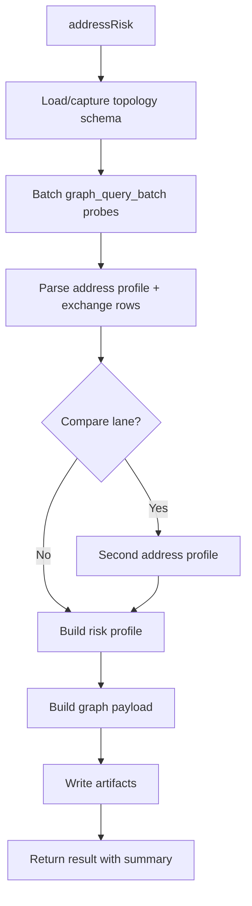

Worker: investigation
Entrypoint: src/investigation
Package: investigation
Language: typescript
Tests: (none detected)

# investigation

## Purpose

Implements AML investigation workflows: address risk screening and comparison,
direct public graph access, and evidence artifact generation. Orchestrates
graph queries (topology/facts reads via graph_query, graph_query_batch),
builds the risk profile (labels, exchange likeness, money-trail lanes), writes
workspace artifacts (Markdown reports, graph JSON/HTML, table CSV/HTML,
compact evidence JSON), and returns the profile summary.

## Reads

- **Remote MCP Client:** Calls Chain Insights Graph tools (graph_query, graph_query_batch) via proxy client
- **Workspace output paths:** Reads/creates workspace directory structure (reports/graphs/, reports/tables/, artifacts/, schema/)
- **Investigation config:** address, network, optional compare address, writeArtifacts toggle

## Writes

- **Workspace schema files:** <network>.graph-schema.json (runtime topology schema: node labels, relationship types, property keys)
- **Compact evidence JSON:** <timestamp>_aml_address_risk_<network>_<address>.compact-evidence.json (address risk profile: screen, exchange rows, report summary)
- **Graph JSON/HTML:** <timestamp>_aml_address_risk_<network>_<address>.graph.json and .graph.html (nodes, edges, flow metadata, graph app view)
- **Table CSV/HTML:** <timestamp>_aml_address_risk_<network>_<address>.flows.csv and .table.html (exchange likeness rows with direction, hops, amounts)
- **Report Markdown:** <timestamp>_aml_address_risk_<network>_<address>.aml-address-report.md (summary, file references)

## Flow



## Invariants

- **Exact-address keying:** Addresses are resolved by their raw chain-native
  key directly; there is no identity-resolution step and no member-address
  satellite.
- **One public network:** `robinhood` (EVM H160); `graph_query`/`graph_query_batch`
  route by `USE topology` / `USE facts` with no network switch.
- **Address normalization:** All blockchain addresses preserved as full strings (no truncation, no ellipsis)
- **Compact evidence:** Address risk profile (labels, exchange likeness,
  money-trail lanes) in structuredContent; artifacts hold the full profile
- **Stateless proxy mode:** When writeArtifacts=false, returns summary + structuredContent without workspace writes

## Run

```bash
# Screen an address (CLI)
cia mcp call aml_address_risk \
  network=robinhood \
  address=0x1234... \
  include_attachments=true
# → Calls addressRisk(), writes artifacts to active workspace, returns summary

# Compare two addresses (MCP tool call)
{
  "name": "aml_address_risk",
  "arguments": {
    "network": "robinhood",
    "address": "0xabc...",
    "compare_address": "0xdef..."
  }
}
# → Runs the compare lane, writes artifacts

# Direct public graph access (MCP tool call)
{
  "name": "graph_query",
  "arguments": {
    "network": "robinhood",
    "query": "USE topology MATCH (a:Address {address: '0x1234...'})-[f:FLOWS_TO]->(b:Address) RETURN a.address AS address, b.address AS to_address, f.amount_usd_sum AS amount_usd_sum LIMIT 5"
  }
}
# → Serves address-grain topology: FLOWS_TO money flow, LINKED ownership overlay
```

## Verify

```bash
# Manual risk screen
cia mcp call aml_address_risk network=robinhood address=0x1234...
# Check workspace artifacts:
ls -la reports/ reports/graphs/ reports/tables/
# Should show timestamped files: *.graph.json, *.graph.html, *.flows.csv, *.table.html, *.compact-evidence.json

# Verify compact evidence structure
cat reports/tables/*.compact-evidence.json | jq '.schema, .tool, .network, .profile'
# Should contain evidence schema, aml_address_risk tool, network, profile rows

# Verify graph payload
cat reports/graphs/*.graph.json | jq '.schema, .nodes | length, .edges | length'
# Should contain graph schema, nodes with labels/risk_score, edges with amount_usd_sum

# Direct topology access (exact address key)
cia mcp call graph_query network=robinhood "query=USE topology MATCH (a:Address {address:0x1234...}) RETURN a.address AS address LIMIT 1"
# Should return the address node directly, no resolution step
```
