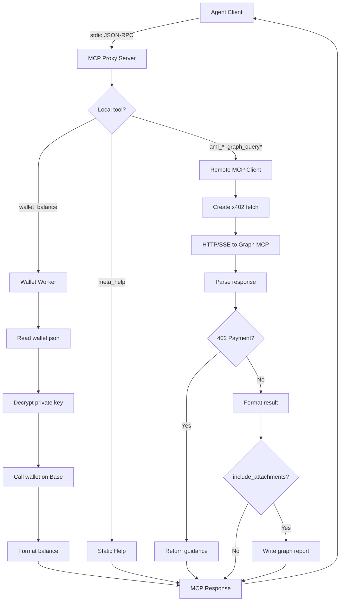

Worker: mcp
Entrypoint: src/mcp
Package: mcp
Language: typescript
Tests: tests/mcp-proxy.test.ts, tests/mcp-client.test.ts, tests/mcp-capabilities.test.ts, tests/mcp-graph-client.test.ts, tests/mcp-graph-reports.test.ts, tests/mcp-print-result.test.ts, tests/mcp-schema-cache.test.ts

# mcp

## Purpose

Implements MCP proxy server (stdio transport) and remote MCP client (HTTP/SSE to Chain Insights Graph). Registers local tools (wallet_balance, meta_help), proxies remote graph tools (aml__, graph_query_), wraps x402 payment fetch, and logs structured tool/topology events. Supports workspace mode (artifact persistence) and stateless mode (proxy-only).

## Reads

- **~/.chain-insights/config.json:** graphMcpEndpoint, graphMcpMode, graphMcpAuthToken, dataDir, serverPort
- **~/.chain-insights/wallet.json:** Encrypted EVM private key for x402 payment (via wallet decryptKey)
- **Chain Insights Graph MCP endpoint:** Remote tool catalog (listTools), tool responses, network capabilities, usage status
- **stdin (stdio transport):** MCP protocol messages from agent client (JSON-RPC tool calls, prompts)

## Writes

- **stdout (stdio transport):** MCP protocol responses to agent client (tool results, structuredContent, errors)
- **stderr:** Diagnostic messages (connection failures, payment guidance, startup errors)
- **~/.chain-insights/runtime/logs/mcp-proxy.jsonl:** Structured logs (tool.start, tool.end, topology.start, topology.end, errors)
- **Workspace artifacts:** Graph HTML reports, compact evidence JSON (when workspace mode enabled)
- **127.0.0.1:serverPort:** HTTP server for graph app resources (when attachments included)

## Flow



## Invariants

- **Stdio purity:** No stdout writes except MCP protocol; diagnostics go to stderr or structured log
- **Proxy starts even when Graph unreachable:** Local tools (wallet, help) remain available; remote tools return error messages
- **Schema cache:** Remote tool catalog cached per endpoint; cache hit skips listTools call (performance optimization)
- **Tool passthrough:** Only remote-advertised tools are proxied; local tools always registered
- **Workspace vs stateless mode:** CHAIN_INSIGHTS_MCP_PROXY_MODE env var controls artifact persistence (default: workspace)
- **Payment wrapping:** x402 fetch auto-handles HTTP 402, one-time allowance setup, and payment retries
- **Structured logging:** JSONL logs include timestamp, level, event, pid, tool/query metadata, redacted secrets
- **Graph app resource:** ui://chain-insights/graph serves HTML with CSP-restricted localhost origins

## Run

```bash
# Start MCP proxy (workspace mode)
chain-insights-mcp-proxy
# → Loads config, connects to Graph, registers tools, listens on stdio

# Start MCP proxy (stateless mode)
CHAIN_INSIGHTS_MCP_PROXY_MODE=stateless chain-insights-mcp-proxy
# → Disables wallet_balance, artifact writes, and graph app resources

# Enable structured logging
CHAIN_INSIGHTS_MCP_LOG_PATH=/var/log/ci-mcp.jsonl chain-insights-mcp-proxy
# → Writes tool/topology events to custom path

# Disable logging
CHAIN_INSIGHTS_MCP_LOG=0 chain-insights-mcp-proxy
# → No log file writes
```

## Verify

```bash
# Test MCP proxy startup
chain-insights-mcp-proxy &
PROXY_PID=$!
echo '{"jsonrpc":"2.0","id":1,"method":"tools/list"}' | chain-insights-mcp-proxy
# Should return JSON-RPC result with tool list

# Test structured logging
tail -f ~/.chain-insights/runtime/logs/mcp-proxy.jsonl
# Should see {"ts":"...","level":"info","event":"proxy.start",...}

# Test local tool when Graph unavailable
export CHAIN_INSIGHTS_GRAPH_MCP_ENDPOINT=http://invalid:9999/mcp
echo '{"jsonrpc":"2.0","id":1,"method":"tools/call","params":{"name":"meta_help","arguments":{}}}' | chain-insights-mcp-proxy
# Should return help text despite Graph connection failure

# Cleanup
kill $PROXY_PID
```
