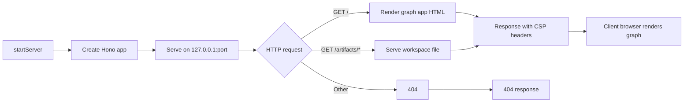

Worker: server
Entrypoint: src/server
Package: server
Language: typescript
Tests: tests/server.test.ts, tests/resolve-port.test.ts, tests/viz-server.test.ts, tests/topup-server.test.ts, tests/topup-server-proxy-hardening.test.ts

# server

## Purpose

Provides localhost HTTP server for Chain Insights graph app visualization and static artifact serving. Binds to 127.0.0.1:configuredPort (default 4321), serves graph HTML reports with embedded Cytoscape.js vis, and proxies MCP requests for graph app resources. Enables agent clients to render interactive fund-flow graphs in-browser without external dependencies.

## Reads

- **Config:** serverPort from ~ /.chain-insights/config.json
- **Workspace artifacts:** Reads graph JSON, HTML templates, static assets from workspace paths
- **HTTP requests:** GET / for graph app HTML, GET /artifacts/* for workspace files

## Writes

- **HTTP responses:** Graph app HTML, JSON artifacts, static files (read-only, no mutation)
- **stdout:** Startup message ("Chain Insights server running on http://127.0.0.1:port")
- **stderr:** Error messages (port in use, server failure)

## Flow



## Invariants

- **Localhost-only binding:** Hostname is 127.0.0.1 (never 0.0.0.0) for security
- **No mutation:** Server is read-only; no POST/PUT/DELETE endpoints
- **CSP-restricted origins:** Connect-src and resource-src limited to localhost ports (prevents external XSS)
- **Port conflicts:** EADDRINUSE logs error and exits with code 1 (no automatic retry)
- **Graceful shutdown:** SIGINT/SIGTERM close server and exit cleanly
- **Static serving:** Graph HTML template embedded in dist/, no external CDN dependencies

## Run

```bash
# Start server from an initialized workspace
cia serve
# → Listens on http://127.0.0.1:4321

# Start with custom port (config override)
cia config set serverPort 9999
cia serve
# → Listens on http://127.0.0.1:9999

# Server auto-started by MCP proxy when graph app resources requested
# (No manual start required for normal use)
```

## Verify

```bash
# Test server startup
cia serve &
SERVER_PID=$!
sleep 2

# Test graph app endpoint
curl -s http://127.0.0.1:4321/ | head -20
# Should return HTML with "<!doctype html>" and Cytoscape.js script tags

# Test artifact serving (if workspace has artifacts)
curl -s http://127.0.0.1:4321/artifacts/nonexistent | head -5
# Should return 404

# Cleanup
kill $SERVER_PID
```
