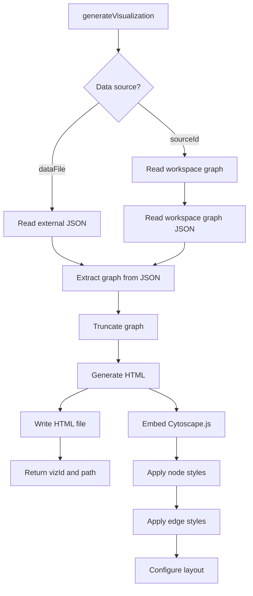

Worker: viz
Entrypoint: src/viz
Package: viz
Language: typescript
Tests: tests/viz-cli.test.ts, tests/viz-data-extractor.test.ts, tests/viz-graph-model.test.ts, tests/viz-html-generator.test.ts, tests/viz-server.test.ts

# viz

## Purpose

Generates interactive HTML graph visualizations from Chain Insights investigation results. Extracts graph structures from JSON artifacts (or ad-hoc transaction data), renders Cytoscape.js force-directed layouts with node/edge styling (risk levels, labels, flow amounts), writes HTML files to workspace, and provides generateVisualization() CLI for custom viz creation.

## Reads

- **Workspace graph JSON:** <timestamp>_<address>.graph.json (nodes, edges, metadata from investigation)
- **Ad-hoc JSON data:** Optional external file with transaction objects (from, to, value fields)
- **Templates:** Graph HTML template from dist/templates/ or src/viz/templates/
- **Graph model schemas:** chain-insights.graph.v1 payload structure

## Writes

- **Workspace graph HTML:** <timestamp>_<address>.graph.html or <vizId>.html (self-contained HTML with embedded Cytoscape.js, styles, and graph data)
- **Ad-hoc visualizations:** Custom HTML files for user-provided transaction data
- **Console/stdout:** HTML file paths, visualization IDs, error messages

## Flow



## Invariants

- **Source ID sanitization:** Must match /^[A-Za-z0-9._-]+$/ (no path traversal, no ..)
- **Graph truncation:** Large graphs truncated to prevent browser crashes (configurable limits)
- **Self-contained HTML:** No external CDN dependencies; Cytoscape.js embedded in HTML
- **Workspace precedence:** sourceId reads from the active workspace reports/graphs/ directory
- **Ad-hoc mode:** dataFile bypasses workspace, generates one-off visualization
- **Node styling:** Color-coded by risk_level (red=T1, orange=T2, yellow=T3, green=T6), sized by flow volume
- **Edge styling:** Width proportional to amount_usd_sum, color-coded by direction (outflows blue, inflows gray)
- **Layout:** Force-directed with clustering by labels, exchange nodes anchored at periphery

## Run

```bash
# Generate visualization from workspace graph
cia viz 2026-06-26_012345_0xabc123
# → Reads reports/graphs/2026-06-26_012345_0xabc123.graph.json
# → Writes published/viz/2026-06-26_012345_0xabc123.html
# → Prints "Visualization: http://127.0.0.1:4321/viz/<id>", starts the local
#   server, and opens the URL in a browser

# Generate ad-hoc visualization from external JSON
cia viz --data transactions.json
# → Reads external JSON, extracts graph, generates HTML with an adhoc_<timestamp> ID
```

## Verify

```bash
# Test workspace visualization generation
cia viz <existing-graph-id>
# Check output:
ls -la published/viz/*.html
# Should show new .html file with same base name as source graph

# Test HTML content
cat published/viz/*.html | grep -o '<title>.*</title>'
# Should show graph title with source ID

# Verify Cytoscape.js embedding
cat published/viz/*.html | grep -o 'cytoscape.*\.js' | head -1
# Should show embedded Cytoscape.js script (not CDN link)

# Test ad-hoc mode
echo '[{"from":"0xaaa","to":"0xbbb","value":100}]' > /tmp/tx.json
cia viz --data /tmp/tx.json
# Should generate visualization with 2 nodes, 1 edge
```
