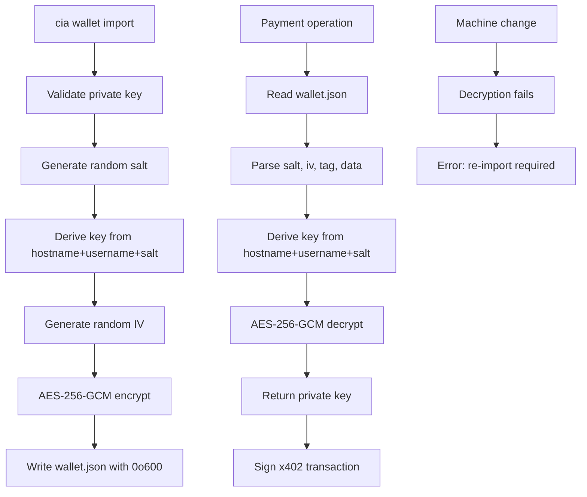

Worker: wallet
Entrypoint: src/wallet
Package: wallet
Language: typescript
Tests: tests/wallet.test.ts, tests/wallet-tools.test.ts

# wallet

## Purpose

Manages encrypted EVM private key storage for x402 micropayments on Chain Insights Graph tools. Imports private keys, encrypts with machine-identity-derived key (hostname + username + random salt), stores at ~/.chain-insights/wallet.json (0o600 permissions), decrypts for payment operations, and provides wallet account/balance tools for MCP clients.

## Reads

- **~/.chain-insights/wallet.json:** Encrypted wallet data (salt, iv, tag, data fields)
- **Machine identity:** os.hostname(), os.userInfo().username for key derivation
- **Private key input:** User-provided 0x-prefixed EVM private key (via `cia wallet import`)

## Writes

- **~/.chain-insights/wallet.json:** Encrypted wallet file (AES-256-GCM, 0o600 permissions)
- **x402 payment operations:** Base Mainnet USDC transactions (approve, transfer) via viem
- **MCP tool responses:** wallet_balance result (address, network, token, amount)

## Flow



## Invariants

- **0x-prefixed 64-char hex:** Private keys must be /^0x[0-9a-fA-F]{64}$/ (viem validation)
- **AES-256-GCM:** Encryption algorithm with authenticated encryption (GCM tag verification)
- **Machine-identity key:** scrypt with salt (hostname:username || salt) prevents precomputation across wallets
- **Per-wallet salt:** Random 16-byte salt stored in wallet.json (derived from same machine identity reuses salt)
- **File permissions:** wallet.json written with mode 0o600 (owner read/write only)
- **No password derivation:** Key comes from machine identity, not user password (convenience for single-user machines)
- **Decryption binds to machine:** Hostname or username change breaks decryption (must re-import)
- **Address derivation:** Public address derived from private key via viem privateKeyToAccount()

## Run

```bash
# Import wallet (CLI)
cia wallet import 0x1234...cdef (example 64-hex private key)
# → Validates key, encrypts, writes ~/.chain-insights/wallet.json, returns address

# Check wallet ready for payments
cia wallet ready
# → Decrypts wallet, checks Base USDC balance, runs one-time approve if needed, returns funding status

# Topup wallet
cia wallet topup
# → Displays QR code and address for USDC deposit on Base

# Wallet balance (MCP tool)
{"name": "wallet_balance", "arguments": {}}
# → Decrypts wallet, calls wallet on Base, returns address, network, token, amount
```

## Verify

```bash
# Test wallet import
cia wallet import 0xabc...
ls -la ~/.chain-insights/wallet.json
# Should show -rw------- (0o600)

# Test wallet structure
cat ~/.chain-insights/wallet.json | jq '.salt, .iv, .tag, .data'
# Should contain hex-encoded salt (32 chars), iv (24 chars), tag (32 chars), data (variable)

# Test decryption
cia wallet ready
# Should succeed without errors (if wallet imported on same machine)

# Test machine binding failure (simulate)
# Change hostname or username, then:
cia wallet ready
# Should error: "Wallet decryption failed. If you changed your hostname or username, re-import..."

# Test address derivation
cia wallet import 0x1234... # Known key
# Should return deterministic address for that private key
```
